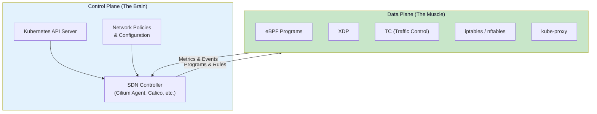
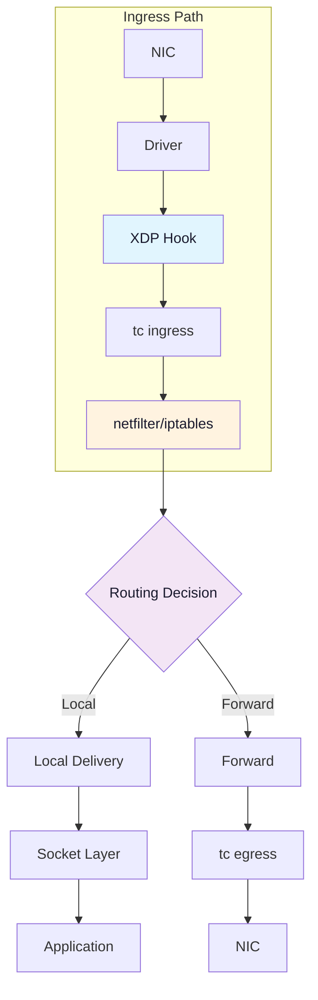
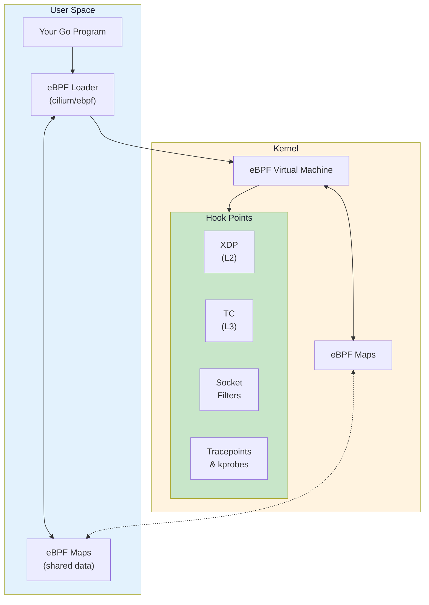
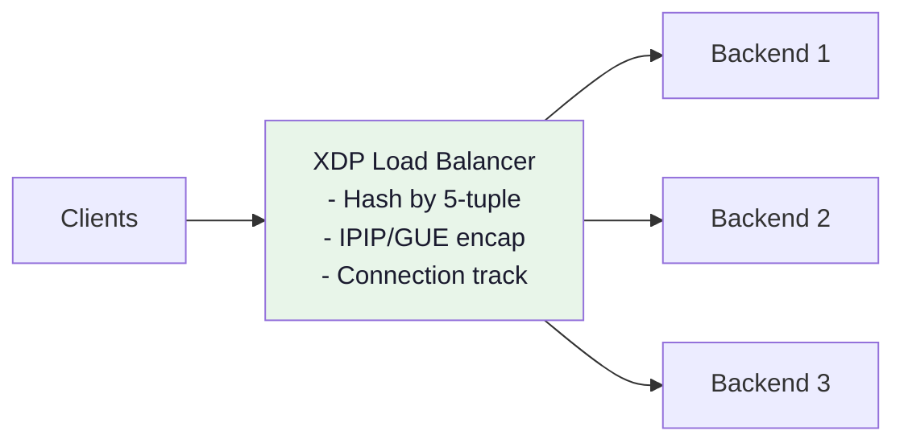
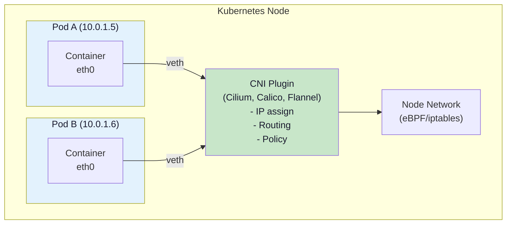

# Cloud-Native Network Programming Roadmap

**Target:** Frontend developers (JS/TS/React/Next.js) with Go knowledge wanting to build cloud networking tools

**Timeline:** 6-8 months (10-15 hours/week)

**Goal:** Contribute to or build cloud networking tools like Cilium, Traefik, CoreDNS, or your own

---

## Why Cloud-Native Networking?

Cloud-native networking is the **hottest area** in infrastructure today:

- **eBPF** is revolutionizing Linux networking, security, and observability
- Companies like Meta, Google, CloudFlare, Netflix use eBPF in production
- **Kubernetes networking** demands specialized skills
- **High demand, low supply** of engineers who understand this stack
- Open source projects (Cilium, Falco, Pixie) are actively seeking contributors

---

## The Big Picture: Software Defined Networking (SDN)

Before diving into implementation, understand this core abstraction that underpins everything in this roadmap:

**SDN separates the brain (control plane) from the muscle (data plane).**




### Why This Abstraction Matters

| Traditional Networking | Software Defined Networking |
|------------------------|----------------------------|
| Config lives on each device | Centralized, programmable control |
| Manual, error-prone changes | Automated, API-driven |
| Vendor-specific CLIs | Open, standard interfaces |
| Static, slow to adapt | Dynamic, responds to workload changes |

### How Your Learning Map Connects to SDN

Everything you'll learn fits into this paradigm:

| SDN Layer | What You'll Learn | Purpose |
|-----------|-------------------|---------|
| **Control Plane** | Kubernetes, CNI plugins, Cilium Agent | Decision-making: "where should traffic go?" |
| **Data Plane** | eBPF, XDP, TC, iptables | Execution: actually moving packets |
| **Programmability** | Go + cilium/ebpf library | How control plane programs data plane |
| **Observability** | eBPF tracing, metrics | Feedback loop from data plane to control |

> **Key Insight:** When you write an XDP program, you're programming the SDN data plane. When you build a CNI plugin, you're building SDN control plane logic. The implementations fade from memory, but this mental model stays.

### How SDN Came to Be


**The Problem SDN Solved:**

In traditional networking, every device (router, switch, firewall) had its own brain bundled with its muscle. This meant:
- Vendor lock-in with proprietary CLIs
- Manual configuration across dozens of devices
- Slow, error-prone changes

**The Three Eras:**

| Era | Years | Key Idea | Limitation |
|-----|-------|----------|------------|
| **Traditional** | 1990s-2007 | Brain + muscle in same box | Vendor lock-in, manual config |
| **OpenFlow SDN** | 2008-2015 | Extract brain to central controller | Required special hardware |
| **eBPF SDN** | 2016+ | Brain programmable in Linux kernel | None—this is what you're learning! |

**Key Milestones:**
- **2008:** Stanford creates OpenFlow protocol
- **2011:** Open Networking Foundation formed (Google, Facebook, Microsoft)
- **2012:** Google reveals they run SDN in production (B4 network)
- **2016+:** eBPF matures, Cilium brings SDN to Kubernetes

> **Why eBPF wins:** Original SDN needed special OpenFlow hardware. eBPF runs on *any* Linux kernel—no special hardware required. This is why your roadmap focuses on eBPF.

### Why Containers Demanded eBPF

The evolution of compute (physical → VMs → containers) *drove* the evolution of networking:


| Compute Era | Scale | Networking Challenge | Solution |
|-------------|-------|---------------------|----------|
| **Physical** (1990s) | 1 IP per server | Few machines, static | Traditional switches |
| **VMs** (2005+) | 50 VMs per host, migrate | Network must follow VMs | SDN, vSwitch (software) |
| **Containers** (2013+) | 1000s per host, ephemeral | Instant networking, massive scale | eBPF in kernel |

> **The Pattern:** Networking moved *up the stack* as compute virtualized deeper.  
> Hardware switches → Hypervisor vSwitches → Linux kernel (eBPF)

This is why Kubernetes networking uses eBPF (Cilium)—containers are too fast and too many for anything else.

---

## PART I: LEARNING ROADMAP

### Two Tracks, One Journey

```
┌─────────────────────────────────────────────────────────────────────────┐
│                        CORE NETWORKING (Phases 1-4)                     │
│  Foundation skills that work anywhere—Linux, bare metal, VMs, or cloud  │
├─────────────────────────────────────────────────────────────────────────┤
│  Phase 1          Phase 2          Phase 3          Phase 4             │
│  Linux Net    →   Go Sockets   →   eBPF         →   XDP                 │
│  (2-3 weeks)      (2-3 weeks)      (4-5 weeks)      (3-4 weeks)         │
└─────────────────────────────────────────────────────────────────────────┘
                                    │
                                    ▼
┌─────────────────────────────────────────────────────────────────────────┐
│                    CLOUD-NATIVE EXTENSION (Phases 5-6)                  │
│         Apply your skills to Kubernetes and production systems          │
├─────────────────────────────────────────────────────────────────────────┤
│  Phase 5                              Phase 6                           │
│  Kubernetes & CNI                 →   Real Projects                     │
│  (4-5 weeks)                          (5-6 weeks)                       │
└─────────────────────────────────────────────────────────────────────────┘
```

| Track | Phases | What You'll Build | Standalone Value? |
|-------|--------|-------------------|-------------------|
| **Core** | 1-4 | Load balancers, firewalls, packet tools | ✅ Yes—valuable without K8s |
| **Cloud-Native** | 5-6 | CNI plugins, observability, Cilium | Extends Core to K8s |

> **Your goal:** Complete both tracks to become a **cloud-native network programmer**.

---

### Phase 1: Linux Networking Deep Dive (2-3 weeks)

**Objectives:**
- Master OSI model layers 2-4 (Ethernet, IP, TCP/UDP)
- Understand Linux kernel networking stack
- Master packet flow through Linux
- Understand namespaces and virtual networking

**Key Concepts:**



**Topics:**
- IP addressing, subnetting, CIDR
- TCP: 3-way handshake, state machine, congestion control
- UDP: connectionless, use cases (DNS, QUIC)
- ARP, MAC addresses, VLANs
- Network namespaces, veth pairs, bridges
- NAT: SNAT, DNAT, masquerading
- Routing: tables, metrics, policy routing

**Exercises:**
1. Create network namespaces and connect with veth pairs
2. Build a virtual network with bridges
3. Trace a packet through iptables with logging
4. Use `tcpdump` to capture and analyze traffic
5. Explore `/proc/net/*` and `/sys/class/net/*`

**Commands to Master:**
```bash
# Network namespaces
ip netns add ns1
ip netns exec ns1 ip link
ip link add veth0 type veth peer name veth1
ip link set veth1 netns ns1

# Packet capture
tcpdump -i any -nn 'tcp port 80'
tcpdump -i eth0 -w capture.pcap

# Routing
ip route show table all
ip rule list
cat /proc/net/route

# iptables (foundation before eBPF)
iptables -t filter -L -v -n
iptables -t nat -L -v -n
conntrack -L
```

---

### Phase 2: Go Network Programming (2-3 weeks)

**Objectives:**
- Master Go's `net` package
- TCP/UDP socket programming
- HTTP internals and proxies
- Understand syscalls for networking

**Projects:**
1. **Port scanner** - Scan ports with goroutine pool
2. **TCP echo server** - Concurrent connection handling
3. **HTTP proxy** - Forward requests, modify headers
4. **DNS client** - Parse DNS wire format
5. **Packet sniffer** - Using raw sockets

**Key Code Patterns:**

```go
// Raw socket for packet capture
fd, err := syscall.Socket(syscall.AF_PACKET, syscall.SOCK_RAW, int(htons(syscall.ETH_P_ALL)))

// Network namespace switching
runtime.LockOSThread()
defer runtime.UnlockOSThread()
netns.Set(targetNs)

// Efficient connection handling
listener, _ := net.Listen("tcp", ":8080")
for {
    conn, _ := listener.Accept()
    go handle(conn)
}
```

**Key Packages:**
- `net` - TCP/UDP sockets
- `net/http` - HTTP client/server
- `syscall` / `golang.org/x/sys/unix` - Low-level syscalls
- `github.com/google/gopacket` - Packet parsing
- `github.com/vishvananda/netlink` - Netlink API
- `github.com/vishvananda/netns` - Network namespaces

---

### Phase 3: eBPF Fundamentals (4-5 weeks)

**This is the core skill that makes cloud-native networking possible.**

**Objectives:**
- Understand eBPF architecture and verifier
- Write eBPF programs in C
- Use cilium/ebpf or libbpf-go from Go
- Master eBPF maps for data sharing
- Attach to various hook points

**What is eBPF?**



**eBPF Hook Points for Networking:**

| Hook | Layer | Use Case | Performance |
|------|-------|----------|-------------|
| XDP | L2/Driver | Packet filtering, DDoS mitigation | Fastest |
| TC (ingress/egress) | L3 | Traffic shaping, load balancing | Fast |
| Socket filters | L4 | Per-socket filtering | Medium |
| cgroup/sock | Socket | Container networking | Medium |
| kprobes | Any | Debugging, tracing | Flexible |

**eBPF Maps (Key-Value Stores):**

```c
// Define a map in eBPF C
struct {
    __uint(type, BPF_MAP_TYPE_HASH);
    __uint(max_entries, 10000);
    __type(key, __u32);   // IP address
    __type(value, __u64); // packet count
} packet_count SEC(".maps");
```

**Projects:**
1. **Packet counter** - Count packets per IP with XDP
2. **Simple firewall** - Drop packets by IP/port
3. **Connection tracker** - Track TCP connections
4. **Latency tracer** - Measure packet latency with kprobes

**Tools:**
- `bpftool` - Inspect loaded eBPF programs
- `bpftrace` - High-level eBPF tracing
- `libbpf` / `cilium/ebpf` - Libraries for loading eBPF

**Resources:**
- "Learning eBPF" by Liz Rice (O'Reilly)
- https://ebpf.io - Official eBPF site
- https://docs.cilium.io/en/latest/bpf/
- https://github.com/cilium/ebpf (Go library)

---

### Phase 4: XDP & High-Performance Packet Processing (3-4 weeks)

**Objectives:**
- Master XDP (eXpress Data Path)
- Process millions of packets per second
- Build load balancers and firewalls
- Understand AF_XDP for user-space processing

**XDP Actions:**

```c
// XDP program return values
XDP_DROP    // Drop packet (DDoS defense)
XDP_PASS    // Pass to normal network stack
XDP_TX      // Bounce packet back out same interface
XDP_REDIRECT // Send to another interface or CPU
XDP_ABORTED // Error, drop with trace
```

**XDP Modes:**

| Mode | Description | Performance |
|------|-------------|-------------|
| Native | Driver support required | Best (40M+ pps) |
| Generic | Works everywhere | Good (1M+ pps) |
| Offloaded | Runs on NIC hardware | Fastest |

**Project: XDP Load Balancer**



**Implementation approach:**
1. Parse Ethernet, IP, TCP/UDP headers in XDP
2. Hash connection 5-tuple
3. Select backend from BPF map
4. Rewrite packet headers (DSR or NAT)
5. Track connection state in BPF map

**Sample XDP Code:**

```c
SEC("xdp")
int xdp_lb(struct xdp_md *ctx) {
    void *data = (void *)(long)ctx->data;
    void *data_end = (void *)(long)ctx->data_end;
    
    struct ethhdr *eth = data;
    if ((void *)(eth + 1) > data_end)
        return XDP_PASS;
    
    if (eth->h_proto != htons(ETH_P_IP))
        return XDP_PASS;
    
    struct iphdr *ip = (void *)(eth + 1);
    if ((void *)(ip + 1) > data_end)
        return XDP_PASS;
    
    // Look up backend in BPF map
    __u32 key = ip->daddr;
    struct backend *backend = bpf_map_lookup_elem(&backends, &key);
    if (!backend)
        return XDP_PASS;
    
    // Rewrite destination IP
    ip->daddr = backend->ip;
    ip->check = 0;
    ip->check = checksum((void *)ip, sizeof(*ip));
    
    return XDP_TX;  // Send back out
}
```

---

### Phase 5: Kubernetes Networking & CNI (4-5 weeks)

**Objectives:**
- Understand Kubernetes networking model
- Build a CNI plugin from scratch
- Understand how Cilium/Calico work
- Master Network Policies

**Kubernetes Networking Model:**



**CNI Plugin Development:**

A CNI plugin is just an executable that handles:
- `ADD` - Set up networking for a container
- `DEL` - Clean up networking
- `CHECK` - Verify networking is correct

**Simple CNI Plugin Structure:**

```go
// main.go
func cmdAdd(args *skel.CmdArgs) error {
    // 1. Parse config
    conf, _ := parseConfig(args.StdinData)
    
    // 2. Create veth pair
    hostVeth, containerVeth, _ := ip.SetupVeth(args.IfName, 1500, "", args.Netns)
    
    // 3. Assign IP address
    ipConfig := &current.IPConfig{
        Address: *ipAddr,
        Gateway: gateway,
    }
    
    // 4. Set up routes
    netns.Do(func(_ ns.NetNS) error {
        return ip.AddRoute(defaultRoute, gateway, containerVeth)
    })
    
    return types.PrintResult(result, conf.CNIVersion)
}
```

**Projects:**
1. **Simple CNI plugin** - Assign IPs, create veth pairs
2. **eBPF-based CNI** - Use eBPF for routing instead of iptables
3. **Network Policy enforcer** - Implement K8s NetworkPolicy with eBPF

**Key Concepts:**
- Pod networking (every pod gets an IP)
- Service networking (ClusterIP, NodePort, LoadBalancer)
- kube-proxy modes (iptables, IPVS, eBPF)
- Gateway API (modern) / Ingress (legacy)
- Network Policies

---

### Phase 6: Building Real Tools (5-6 weeks)

**Choose one or more projects:**

#### Option A: L4 Load Balancer (like Cilium's)

```
Features:
- XDP-based packet processing
- Maglev consistent hashing
- DSR (Direct Server Return)
- Health checking
- Connection tracking
- Graceful backend addition/removal
```

#### Option B: Network Observability Tool (like Pixie/Hubble)

```
Features:
- eBPF-based packet capture
- Protocol parsing (HTTP, gRPC, DNS)
- Latency histograms
- Connection flow visualization
- Kubernetes-aware (pod/service names)
```

#### Option C: DNS Proxy/Server (like CoreDNS)

```
Features:
- DNS protocol implementation
- Plugin architecture
- Kubernetes integration
- Caching
- Load balancing
- Metrics export
```

#### Option D: Service Mesh Data Plane (like Envoy, but simpler)

```
Features:  
- L7 proxy with eBPF acceleration
- mTLS termination
- Traffic routing
- Circuit breaking
- Rate limiting
```

---

## PART II: TECHNOLOGY DEEP DIVES

### Essential Go Packages

```bash
# eBPF
go get github.com/cilium/ebpf

# Networking
go get github.com/vishvananda/netlink
go get github.com/vishvananda/netns  
go get github.com/google/gopacket

# Kubernetes
go get k8s.io/client-go
go get github.com/containernetworking/cni

# Observability
go get github.com/prometheus/client_golang

# Utilities
go get github.com/rs/zerolog
go get github.com/spf13/cobra
```

### eBPF Development Setup

```bash
# Install dependencies (Ubuntu/Debian)
sudo apt install -y clang llvm libelf-dev libbpf-dev \
    linux-headers-$(uname -r) bpftool

# Install bpf2go (generates Go from eBPF C)
go install github.com/cilium/ebpf/cmd/bpf2go@latest

# Project structure
myproject/
├── bpf/
│   └── program.c          # eBPF C code
├── main.go                 # Go loader
├── program_bpfel.go        # Generated (little endian)
├── program_bpfeb.go        # Generated (big endian)
└── go.mod

# Generate Go bindings
//go:generate go run github.com/cilium/ebpf/cmd/bpf2go -cc clang program ./bpf/program.c
```

### Kernel Version Requirements

| Feature | Minimum Kernel | Recommended |
|---------|---------------|-------------|
| Basic eBPF | 4.4 | 5.4+ |
| XDP | 4.8 | 5.4+ |
| BTF (CO-RE) | 5.2 | 5.8+ |
| Ring buffer | 5.8 | 5.8+ |
| bpf_loop | 5.17 | 5.17+ |

---

## PART III: PROJECTS BREAKDOWN

### Month 1-2: Foundation

**Week 1-2: Linux Networking**
- Set up lab environment (VMs with multiple interfaces)
- Create network namespaces, veth pairs, bridges
- Master tcpdump, iptables, routing

**Week 3-4: Go Networking**
- Build TCP/UDP servers
- Implement packet sniffer with gopacket
- Build simple HTTP proxy

**Week 5-6: eBPF Hello World**
- Set up eBPF development environment
- Write first XDP program (packet counter)
- Use bpftool to inspect programs

**Week 7-8: eBPF Maps**
- Implement hash maps, arrays
- Share data between kernel and user space
- Build simple firewall

### Month 3-4: Intermediate

**Week 9-10: XDP Deep Dive**
- Parse Ethernet, IP, TCP headers
- Implement packet rewriting
- Build L3/L4 load balancer

**Week 11-12: Connection Tracking**
- Implement connection state machine
- Track 5-tuple connections
- Handle NAT

**Week 13-14: Kubernetes Basics**
- Set up local Kubernetes cluster
- Understand pod networking
- Trace packets through kube-proxy

**Week 15-16: CNI Development**
- Write simple CNI plugin
- Integrate with Kubernetes
- Test with pods

### Month 5-6: Advanced

**Week 17-20: Main Project**
- Choose from Phase 6 projects
- Design architecture
- Implement core features

**Week 21-24: Polish & Production**
- Add metrics and logging
- Write tests
- Documentation
- Performance optimization

---

## PART IV: RESOURCES

### Books
- "Learning eBPF" - Liz Rice (ESSENTIAL)
- "Linux Observability with BPF" - David Calavera
- "BPF Performance Tools" - Brendan Gregg
- "Kubernetes Networking" - James Strong & Vallery Lancey
- "Network Programming with Go" - Adam Woodbeck

### Online Resources
- https://ebpf.io - Official eBPF site
- https://docs.cilium.io - Cilium documentation
- https://github.com/xdp-project/xdp-tutorial - XDP tutorial
- https://nakryiko.com/posts/ - Andrii Nakryiko's blog (eBPF maintainer)
- https://www.brendangregg.com/ebpf.html - Brendan Gregg's eBPF page

### Videos
- [eBPF - Everything You Need to Know in 5 Minutes](https://www.youtube.com/watch?v=KhPrMW5Rbbc) - Thomas Graf (CTO, Isovalent) KubeCon keynote - Quick intro to eBPF

### Projects to Study
- **Cilium** - eBPF-based Kubernetes networking
- **Katran** - Facebook's L4 load balancer
- **Calico** - Kubernetes networking with eBPF mode
- **Falco** - eBPF-based security
- **Pixie** - eBPF-based observability
- **CoreDNS** - DNS server in Go
- **Traefik** - Cloud-native proxy

### Communities
- eBPF Slack: https://ebpf.io/slack
- Cilium Slack: https://cilium.slack.com
- CNCF Slack: https://slack.cncf.io
- r/kubernetes, r/golang

---

## PART V: CAREER PATH

After completing this roadmap, you'll be qualified for:

- **Cloud Network Engineer** at hyperscalers (Google, Meta, AWS)
- **Kubernetes Networking Specialist**
- **eBPF Engineer** (very high demand)
- **Open Source Contributor** (Cilium, Calico, Falco)
- **SRE/Platform Engineer** with networking focus
- **Security Engineer** (eBPF-based security tools)

**Salary Range:** $150K-$300K+ for senior eBPF engineers

### Further Learning
- DPDK for user-space networking
- P4 programming
- SmartNIC programming
- Kernel development
- Network security (DDoS mitigation)

---

## TIMELINE SUMMARY

**Total: 6-8 months** (10-15 hours/week)

| Month | Focus | Deliverable |
|-------|-------|-------------|
| 1 | Linux networking + Go | Packet sniffer, HTTP proxy |
| 2 | eBPF fundamentals | XDP packet counter, firewall |
| 3 | XDP deep dive | L4 load balancer |
| 4 | Kubernetes networking | Simple CNI plugin |
| 5 | Main project | Core implementation |
| 6 | Production ready | Complete project |

---

## YOUR ADVANTAGES

As a frontend developer with Go knowledge:

1. **Full-stack observability tools** - Build dashboards for your eBPF tools
2. **Developer experience** - Make CLI and APIs that developers love
3. **Documentation** - Clear docs are rare in this space
4. **Visualization** - Network topology, flow diagrams

This combination of **low-level kernel programming + user-friendly interfaces** is extremely rare and valuable!

---

## NEXT STEPS

1. **This week:** Set up Linux VM, create network namespaces
2. **Install:** bpftool, clang, llvm, Go 1.21+
3. **Read:** First 2 chapters of "Learning eBPF"
4. **Code:** Write your first XDP program
5. **Join:** eBPF Slack community

**Good luck on your journey to becoming a cloud-native network engineer!** 🚀