# Module 08: eBPF Virtual Machine Deep Dive

> **Book Reference:** Chapter 3 - Anatomy of an eBPF Program

## 📊 Visual Learning


---

## What is the eBPF Virtual Machine?

The eBPF Virtual Machine is a **software CPU** running inside the Linux kernel. It executes eBPF bytecode in a sandboxed environment, providing both **safety** and **performance**.

### Why a Virtual Machine?

```mermaid
flowchart LR
    subgraph problem["❌ Traditional Kernel Programming"]
        KMOD["Kernel Module"]
        RISK["Risk: Crash entire system"]
        SLOW["Slow: Requires recompilation"]
        KMOD --> RISK
        KMOD --> SLOW
    end
    
    subgraph solution["✅ eBPF Approach"]
        EBPF["eBPF Bytecode"]
        VERIFY["Verified: Can't crash kernel"]
        DYNAMIC["Dynamic: Load at runtime"]
        EBPF --> VERIFY
        EBPF --> DYNAMIC
    end
    
    style problem fill:#ffebee
    style solution fill:#e8f5e9
```



---

## eBPF Registers

The eBPF VM has **11 registers**, each 64-bit wide:

| Register | Purpose | Description |
|----------|---------|-------------|
| **R0** | Return value | Function return, also used for helper return values |
| **R1-R5** | Arguments | Pass arguments to functions and helpers |
| **R6-R9** | Callee-saved | Preserved across function calls (your scratch space) |
| **R10** | Frame pointer | Points to stack frame (read-only) |

### Register Usage Example

```c
// When your XDP program is called:
// R1 = pointer to xdp_md context (your input!)
// R10 = stack frame pointer

SEC("xdp")
int my_program(struct xdp_md *ctx) {  // ctx arrives in R1
    __u64 my_var = 42;                // Stored relative to R10 (stack)
    
    // When calling a helper:
    // bpf_map_lookup_elem(&my_map, &key)
    // R1 = &my_map
    // R2 = &key
    // Return value comes back in R0
    
    return XDP_PASS;  // Return value goes in R0
}
```

---

## eBPF Instruction Set

The eBPF instruction set is **RISC-like** (Reduced Instruction Set Computer) with fixed-size 64-bit instructions.

### Instruction Categories


### Instruction Format

Each eBPF instruction is **64 bits** (8 bytes):

```
┌──────┬──────┬──────┬──────┬─────────────────────┐
│ op   │ dst  │ src  │ off  │ imm                 │
│ 8bit │ 4bit │ 4bit │ 16bit│ 32bit               │
└──────┴──────┴──────┴──────┴─────────────────────┘
```

| Field | Size | Description |
|-------|------|-------------|
| `op` | 8 bits | Operation code |
| `dst` | 4 bits | Destination register (R0-R10) |
| `src` | 4 bits | Source register |
| `off` | 16 bits | Offset for memory operations |
| `imm` | 32 bits | Immediate value |

### Example: Viewing eBPF Bytecode

```bash
# Compile C to eBPF object
clang -target bpf -O2 -g -c program.c -o program.o

# Dump bytecode (human-readable)
llvm-objdump -S program.o

# Output example:
# 0:   bf 16 00 00 00 00 00 00   r6 = r1           ; Save context
# 1:   61 11 04 00 00 00 00 00   r1 = *(u32*)(r1+4); Load data_end
# 2:   61 62 00 00 00 00 00 00   r2 = *(u32*)(r6+0); Load data
```

---

## The Compilation Pipeline

Your eBPF program goes through multiple transformations:

### Stage 1: C Source → eBPF Bytecode

```bash
clang -target bpf -O2 -g -c program.c -o program.o
```

Clang compiles your C code to eBPF bytecode (ELF object file).

### Stage 2: User Space → Kernel

```go
// cilium/ebpf in Go
objs := programObjects{}
loadProgramObjects(&objs, nil)  // Loads bytecode into kernel
```

The `bpf()` system call loads bytecode into the kernel.

### Stage 3: Verifier Checks


### Stage 4: JIT Compilation

The JIT (Just-In-Time) compiler converts eBPF bytecode to **native machine code** for your CPU architecture.

```bash
# Check if JIT is enabled
cat /proc/sys/net/core/bpf_jit_enable
# 0 = disabled, 1 = enabled, 2 = enabled with debugging

# Enable JIT (for performance)
sudo sysctl -w net.core.bpf_jit_enable=1
```

### Performance: Interpreted vs JIT

| Mode | Performance | Use Case |
|------|-------------|----------|
| Interpreted | Slower | Debugging, older kernels |
| JIT compiled | **Near-native** | Production, default on modern kernels |

---

## Memory Model

### Stack

Each eBPF program has a **512-byte stack** (much smaller than user space!).

```c
SEC("xdp")
int my_program(struct xdp_md *ctx) {
    // Stack allocation - max 512 bytes total!
    char buffer[256];      // OK
    struct my_struct data; // As long as total < 512
    
    // ❌ This will fail verification:
    // char huge[1024];    // Too large!
    
    return XDP_PASS;
}
```

### Memory Access Rules

```mermaid
flowchart LR
    subgraph allowed["✅ Allowed Memory Access"]
        STACK["Stack\n(R10 relative)"]
        MAP["BPF Maps\n(via helpers)"]
        CTX["Context\n(program type specific)"]
        PKT["Packet Data\n(bounds checked)"]
    end
    
    subgraph denied["❌ Not Allowed"]
        KERNEL["Arbitrary Kernel Memory"]
        USER["User Space Memory*"]
    end
    
    style allowed fill:#e8f5e9
    style denied fill:#ffebee
```



> **Note:** `bpf_probe_read_user()` helper can safely read user memory in certain program types.

---

## Program Types and Contexts

Each eBPF program type receives a different **context structure**:

| Program Type | Context Struct | Description |
|-------------|----------------|-------------|
| XDP | `struct xdp_md` | Raw packet data pointers |
| TC | `struct __sk_buff` | Socket buffer metadata |
| kprobe | `struct pt_regs` | CPU register state |
| tracepoint | Tracepoint-specific | Event data |
| socket | `struct __sk_buff` | Socket buffer |
| cgroup/sock | `struct bpf_sock` | Socket properties |

### XDP Context Example

```c
struct xdp_md {
    __u32 data;        // Packet data start (pointer as u32)
    __u32 data_end;    // Packet data end
    __u32 data_meta;   // Metadata before packet
    __u32 ingress_ifindex;  // Incoming interface
    __u32 rx_queue_index;   // RX queue
    __u32 egress_ifindex;   // For XDP_TX (kernel 5.8+)
};

// Usage pattern
SEC("xdp")
int example(struct xdp_md *ctx) {
    void *data = (void *)(long)ctx->data;
    void *data_end = (void *)(long)ctx->data_end;
    
    // ALWAYS bounds check before access!
    struct ethhdr *eth = data;
    if ((void *)(eth + 1) > data_end)
        return XDP_PASS;
    
    // Now safe to access eth->h_proto, etc.
}
```

---

## Helper Functions

eBPF programs can't call arbitrary kernel functions. Instead, they use **BPF helpers**:

### Helper Categories


### Helper Availability by Program Type

Not all helpers are available to all program types:

| Helper | XDP | TC | kprobe | tracepoint |
|--------|-----|-----|--------|------------|
| `bpf_map_*` | ✅ | ✅ | ✅ | ✅ |
| `bpf_redirect` | ✅ | ✅ | ❌ | ❌ |
| `bpf_xdp_adjust_head` | ✅ | ❌ | ❌ | ❌ |
| `bpf_probe_read` | ❌ | ❌ | ✅ | ✅ |
| `bpf_skb_load_bytes` | ❌ | ✅ | ❌ | ❌ |

---

## Practical Exercise: Explore eBPF Bytecode

### Goal

Compile an eBPF program and inspect its bytecode to understand the VM execution.

### Step 1: Write a Simple Program

```c
// minimal.bpf.c
#include <linux/bpf.h>
#include <bpf/bpf_helpers.h>

SEC("xdp")
int minimal_xdp(struct xdp_md *ctx) {
    // Count something simple
    __u64 ts = bpf_ktime_get_ns();
    
    if (ts % 2 == 0)
        return XDP_PASS;
    else
        return XDP_DROP;
}

char LICENSE[] SEC("license") = "GPL";
```

### Step 2: Compile

```bash
clang -target bpf -O2 -g -c minimal.bpf.c -o minimal.bpf.o
```

### Step 3: Inspect Bytecode

```bash
# View sections
llvm-objdump -h minimal.bpf.o

# Disassemble
llvm-objdump -S minimal.bpf.o
```

### Step 4: Load and Inspect with bpftool

```bash
# Load program
sudo bpftool prog load minimal.bpf.o /sys/fs/bpf/minimal

# List programs
sudo bpftool prog list

# See JIT-compiled code (if JIT enabled)
sudo bpftool prog dump jited name minimal_xdp
```

---

## The Verifier in Detail


### Common Verifier Errors and Fixes

#### 1. Unbounded Memory Access

```c
// ❌ ERROR: Unbounded access
struct iphdr *ip = data + sizeof(struct ethhdr);
__u8 protocol = ip->protocol;  // Might read past data_end!

// ✅ FIX: Always bounds check
struct iphdr *ip = data + sizeof(struct ethhdr);
if ((void *)(ip + 1) > data_end)
    return XDP_PASS;
__u8 protocol = ip->protocol;  // Now safe
```

#### 2. Unbounded Loops

```c
// ❌ ERROR: Unbounded loop
for (int i = 0; i < n; i++) { }  // n is variable!

// ✅ FIX: Use constant bounds or bpf_loop
#pragma unroll
for (int i = 0; i < 10; i++) { }  // Constant bound

// Or use bpf_loop helper (kernel 5.17+)
bpf_loop(100, callback_fn, &ctx, 0);
```

#### 3. Invalid Map Access

```c
// ❌ ERROR: Using map value without null check
__u64 *value = bpf_map_lookup_elem(&my_map, &key);
*value += 1;  // Might be NULL!

// ✅ FIX: Always check for NULL
__u64 *value = bpf_map_lookup_elem(&my_map, &key);
if (value)
    *value += 1;
```

---

## Key Takeaways

1. **eBPF is a VM** - Sandboxed execution inside the kernel
2. **11 registers** - R0-R10, with specific conventions
3. **512-byte stack** - Very limited, plan carefully
4. **JIT compilation** - Near-native performance in production
5. **Verifier is essential** - Guarantees kernel safety
6. **Helpers are your API** - The only way to interact with kernel

---

## Next Steps

- **Module 09:** Master eBPF Maps for data sharing
- **Module 10:** Learn CO-RE for portable programs
- **Module 11:** Deep dive into networking hooks

---

## Further Reading

- [Learning eBPF - Chapter 3](https://learning.oreilly.com/library/view/learning-ebpf/) - Anatomy of an eBPF Program
- [eBPF Instruction Set Specification](https://docs.kernel.org/bpf/instruction-set.html)
- [BPF Helper Functions](https://man7.org/linux/man-pages/man7/bpf-helpers.7.html)
