# Module 09: eBPF Maps Mastery

> **Book Reference:** Chapter 2 - Maps & Chapter 5 - More Maps

## 📊 Visual Learning


---

## What are eBPF Maps?

eBPF Maps are **key-value data structures** that live in the kernel and serve three critical purposes:

```mermaid
flowchart LR
    subgraph purposes["eBPF Map Purposes"]
        P1["🔄 Share Data\nBetween eBPF programs"]
        P2["📊 Persist State\nAcross program invocations"]
        P3["🔗 Communicate\nWith user space"]
    end
    
    KERNEL["Kernel Space"] <--> MAP[(eBPF Map)]
    MAP <--> USER["User Space"]
    
    style MAP fill:#e8f5e9
```



---

## Map Types Overview

### General Purpose Maps

| Map Type | Lookup | Key | Use Case |
|----------|--------|-----|----------|
| `HASH` | O(1) | Any | Connection tracking |
| `ARRAY` | O(1) | Integer index | Fixed-size counters |
| `LRU_HASH` | O(1) | Any | Auto-evicting cache |
| `LRU_PERCPU_HASH` | O(1) | Any | Per-CPU LRU cache |

### Per-CPU Maps (Lock-Free!)

| Map Type | Description | Best For |
|----------|-------------|----------|
| `PERCPU_HASH` | Per-CPU hash table | High-frequency counters |
| `PERCPU_ARRAY` | Per-CPU array | Statistics per CPU |

### Special Purpose Maps

| Map Type | Description | Use Case |
|----------|-------------|----------|
| `RINGBUF` | Ring buffer | Event streaming to user space |
| `PERF_EVENT_ARRAY` | Per-CPU perf buffers | Legacy event streaming |
| `DEVMAP` | Device map | XDP redirects |
| `CPUMAP` | CPU map | XDP CPU steering |
| `SOCKMAP` | Socket map | Socket redirection |
| `PROG_ARRAY` | Program array | Tail calls |

---

## Hash Maps

The most commonly used map type for networking.

### Definition

```c
struct {
    __uint(type, BPF_MAP_TYPE_HASH);
    __uint(max_entries, 10000);
    __type(key, __u32);         // e.g., IP address
    __type(value, __u64);       // e.g., packet count
} connection_count SEC(".maps");
```

### Operations in eBPF

```c
// Lookup
__u64 *value = bpf_map_lookup_elem(&connection_count, &ip);
if (value) {
    // Key exists
    __sync_fetch_and_add(value, 1);  // Atomic increment
}

// Insert/Update
__u64 count = 1;
bpf_map_update_elem(&connection_count, &ip, &count, BPF_ANY);

// Delete
bpf_map_delete_elem(&connection_count, &ip);
```

### Operations in Go (User Space)

```go
// Lookup
var count uint64
err := objs.ConnectionCount.Lookup(ip, &count)

// Update
err = objs.ConnectionCount.Put(ip, count)

// Delete
err = objs.ConnectionCount.Delete(ip)

// Iterate
iter := objs.ConnectionCount.Iterate()
for iter.Next(&ip, &count) {
    fmt.Printf("IP: %v, Count: %d\n", ip, count)
}
```

### Update Flags

```c
// BPF_ANY    - Create or update
// BPF_NOEXIST - Only insert if key doesn't exist
// BPF_EXIST  - Only update if key exists

bpf_map_update_elem(&map, &key, &value, BPF_NOEXIST);  // Insert only
bpf_map_update_elem(&map, &key, &value, BPF_EXIST);   // Update only
```

---

## Array Maps

Fixed-size arrays indexed by integers.

```c
struct stats {
    __u64 packets;
    __u64 bytes;
};

struct {
    __uint(type, BPF_MAP_TYPE_ARRAY);
    __uint(max_entries, 256);  // 256 entries (0-255)
    __type(key, __u32);
    __type(value, struct stats);
} protocol_stats SEC(".maps");

// Usage - index by protocol number
SEC("xdp")
int count_by_protocol(struct xdp_md *ctx) {
    struct iphdr *ip = ...;  // Parse packet
    
    __u32 protocol = ip->protocol;  // TCP=6, UDP=17, ICMP=1
    struct stats *s = bpf_map_lookup_elem(&protocol_stats, &protocol);
    
    if (s) {
        __sync_fetch_and_add(&s->packets, 1);
        __sync_fetch_and_add(&s->bytes, ctx->data_end - ctx->data);
    }
    
    return XDP_PASS;
}
```

### Hash vs Array Comparison

```mermaid
flowchart TB
    subgraph hash["Hash Map"]
        H1["✅ Dynamic keys"]
        H2["✅ Sparse data"]
        H3["✅ Any key type"]
        H4["⚠️ Memory overhead per entry"]
    end
    
    subgraph array["Array Map"]
        A1["✅ Faster lookup"]
        A2["✅ Pre-allocated memory"]
        A3["❌ Integer keys only (0 to max-1)"]
        A4["❌ Wastes memory if sparse"]
    end
    
    style hash fill:#e3f2fd
    style array fill:#fff3e0
```



---

## Per-CPU Maps

**Critical for high-performance networking!** Per-CPU maps avoid lock contention by giving each CPU its own copy.

```c
struct {
    __uint(type, BPF_MAP_TYPE_PERCPU_ARRAY);
    __uint(max_entries, 1);
    __type(key, __u32);
    __type(value, __u64);
} packet_counter SEC(".maps");

SEC("xdp")
int count_packets(struct xdp_md *ctx) {
    __u32 key = 0;
    __u64 *count = bpf_map_lookup_elem(&packet_counter, &key);
    
    if (count) {
        (*count)++;  // No lock needed! Each CPU has its own counter
    }
    
    return XDP_PASS;
}
```

### Reading Per-CPU Maps in Go

```go
// Per-CPU returns a slice (one value per CPU)
type PerCPUCounter []uint64

var counters PerCPUCounter
err := objs.PacketCounter.Lookup(uint32(0), &counters)

// Aggregate across all CPUs
var total uint64
for _, c := range counters {
    total += c
}
fmt.Printf("Total packets: %d\n", total)
```

### When to Use Per-CPU

| Scenario | Regular Map | Per-CPU Map |
|----------|-------------|-------------|
| Low frequency updates | ✅ | Overkill |
| High frequency per-packet | ⚠️ Lock contention | ✅ Lock-free |
| Need exact count | ✅ | Aggregate at read time |
| Memory constrained | ✅ | ❌ Multiplies by CPU count |

---

## LRU Hash Maps

Automatic eviction when full - perfect for connection tracking!

```c
struct conn_key {
    __be32 saddr;
    __be32 daddr;
    __be16 sport;
    __be16 dport;
    __u8   protocol;
} __attribute__((packed));

struct conn_info {
    __u64 packets;
    __u64 bytes;
    __u64 last_seen;  // bpf_ktime_get_ns()
};

struct {
    __uint(type, BPF_MAP_TYPE_LRU_HASH);
    __uint(max_entries, 100000);
    __type(key, struct conn_key);
    __type(value, struct conn_info);
} connections SEC(".maps");

// When full, LRU automatically evicts least recently used entries
```

---

## Ring Buffer (Recommended for Events)

> **Kernel requirement:** 5.8+

The ring buffer is the **modern way** to stream events from eBPF to user space.

### Why Ring Buffer over Perf Buffer?

```mermaid
flowchart TB
    subgraph perf["❌ Perf Buffer (Legacy)"]
        P1["Per-CPU buffers"]
        P2["Memory waste"]
        P3["Data loss under load"]
        P4["User polls each CPU"]
    end
    
    subgraph ring["✅ Ring Buffer (Modern)"]
        R1["Single shared buffer"]
        R2["Memory efficient"]
        R3["Better backpressure"]
        R4["Single poll point"]
    end
    
    style perf fill:#ffebee
    style ring fill:#e8f5e9
```



### Ring Buffer in eBPF

```c
// Define ring buffer
struct {
    __uint(type, BPF_MAP_TYPE_RINGBUF);
    __uint(max_entries, 256 * 1024);  // 256KB
} events SEC(".maps");

// Event structure
struct event {
    __u32 pid;
    __u32 uid;
    char  comm[16];
    __u64 timestamp;
};

SEC("tracepoint/syscalls/sys_enter_execve")
int trace_exec(struct trace_event_raw_sys_enter *ctx) {
    struct event *e;
    
    // Reserve space in ring buffer
    e = bpf_ringbuf_reserve(&events, sizeof(*e), 0);
    if (!e)
        return 0;  // Buffer full
    
    // Fill event data
    e->pid = bpf_get_current_pid_tgid() >> 32;
    e->uid = bpf_get_current_uid_gid() & 0xFFFFFFFF;
    bpf_get_current_comm(&e->comm, sizeof(e->comm));
    e->timestamp = bpf_ktime_get_ns();
    
    // Submit to user space
    bpf_ringbuf_submit(e, 0);
    
    return 0;
}
```

### Ring Buffer in Go

```go
// Open ring buffer reader
rd, err := ringbuf.NewReader(objs.Events)
if err != nil {
    log.Fatal(err)
}
defer rd.Close()

// Read events
for {
    record, err := rd.Read()
    if err != nil {
        if errors.Is(err, ringbuf.ErrClosed) {
            return
        }
        continue
    }
    
    // Parse event
    var event Event
    binary.Read(bytes.NewReader(record.RawSample), binary.LittleEndian, &event)
    
    fmt.Printf("PID: %d, Comm: %s\n", event.Pid, event.Comm)
}
```

---

## Special Maps for Networking

### DEVMAP - XDP Redirect to Interfaces

```c
struct {
    __uint(type, BPF_MAP_TYPE_DEVMAP);
    __uint(max_entries, 256);
    __type(key, __u32);
    __type(value, __u32);  // ifindex
} tx_ports SEC(".maps");

SEC("xdp")
int xdp_redirect_map(struct xdp_md *ctx) {
    // Decide which interface to send to
    __u32 key = /* calculate based on packet */;
    
    return bpf_redirect_map(&tx_ports, key, 0);
}
```

### CPUMAP - Steer Packets to Specific CPUs

```c
struct {
    __uint(type, BPF_MAP_TYPE_CPUMAP);
    __uint(max_entries, 128);  // Max CPUs
    __type(key, __u32);
    __type(value, __u32);  // Queue size
} cpu_map SEC(".maps");

SEC("xdp")
int xdp_balance_cpus(struct xdp_md *ctx) {
    // Hash packet to distribute across CPUs
    __u32 cpu = calculate_hash(ctx) % num_cpus;
    
    return bpf_redirect_map(&cpu_map, cpu, 0);
}
```

### PROG_ARRAY - Tail Calls

Chain multiple eBPF programs together:

```c
struct {
    __uint(type, BPF_MAP_TYPE_PROG_ARRAY);
    __uint(max_entries, 8);
    __type(key, __u32);
    __type(value, __u32);  // Program FD
} handlers SEC(".maps");

SEC("xdp")
int xdp_dispatcher(struct xdp_md *ctx) {
    void *data = (void *)(long)ctx->data;
    struct iphdr *ip = data + sizeof(struct ethhdr);
    
    // Tail call based on protocol
    bpf_tail_call(ctx, &handlers, ip->protocol);
    
    // If tail call fails, default action
    return XDP_PASS;
}

SEC("xdp")
int handle_tcp(struct xdp_md *ctx) {
    // Handle TCP packets
    return XDP_PASS;
}

SEC("xdp")
int handle_udp(struct xdp_md *ctx) {
    // Handle UDP packets
    return XDP_PASS;
}
```

---

## Map-in-Map

Store maps inside maps for dynamic configuration:

```c
// Inner map definition (template)
struct {
    __uint(type, BPF_MAP_TYPE_HASH);
    __uint(max_entries, 100);
    __type(key, __u32);
    __type(value, __u64);
} inner_map SEC(".maps");

// Outer map (array of maps)
struct {
    __uint(type, BPF_MAP_TYPE_ARRAY_OF_MAPS);
    __uint(max_entries, 10);
    __type(key, __u32);
    __array(values, struct inner_map);  // Points to inner map type
} outer_map SEC(".maps");

SEC("xdp")
int lookup_nested(struct xdp_md *ctx) {
    __u32 outer_key = 0;
    __u32 inner_key = /* from packet */;
    
    // First, get inner map
    struct bpf_map *inner = bpf_map_lookup_elem(&outer_map, &outer_key);
    if (!inner)
        return XDP_PASS;
    
    // Then lookup in inner map
    __u64 *value = bpf_map_lookup_elem(inner, &inner_key);
    if (value) {
        // Found!
    }
    
    return XDP_PASS;
}
```

---

## Map Pinning

Persist maps in the BPF filesystem for sharing between programs:

```bash
# View pinned maps
ls /sys/fs/bpf/

# Create pinned map
sudo bpftool map create /sys/fs/bpf/my_map type hash key 4 value 8 entries 100

# Use from bpftool
sudo bpftool map update pinned /sys/fs/bpf/my_map key 0x01 0x00 0x00 0x00 value 0x2a 0x00 0x00 0x00 0x00 0x00 0x00 0x00
```

### Pinning in Go

```go
// Pin map to filesystem
err := objs.MyMap.Pin("/sys/fs/bpf/my_map")

// Load pinned map in another program
pinnedMap, err := ebpf.LoadPinnedMap("/sys/fs/bpf/my_map", nil)
```

---

## Practical Exercise: Build a Rate Limiter

### Goal

Create an XDP rate limiter using maps to track and limit packets per source IP.

### eBPF Code

```c
// rate_limiter.bpf.c
#include "vmlinux.h"
#include <bpf/bpf_helpers.h>
#include <bpf/bpf_endian.h>

#define RATE_LIMIT 100  // packets per second
#define WINDOW_NS  1000000000  // 1 second in nanoseconds

struct rate_info {
    __u64 tokens;      // Available tokens
    __u64 last_update; // Last token update time
};

struct {
    __uint(type, BPF_MAP_TYPE_LRU_HASH);
    __uint(max_entries, 100000);
    __type(key, __u32);  // Source IP
    __type(value, struct rate_info);
} rate_limit_map SEC(".maps");

// Statistics
struct {
    __uint(type, BPF_MAP_TYPE_PERCPU_ARRAY);
    __uint(max_entries, 2);  // 0=passed, 1=dropped
    __type(key, __u32);
    __type(value, __u64);
} stats SEC(".maps");

SEC("xdp")
int rate_limiter(struct xdp_md *ctx) {
    void *data = (void *)(long)ctx->data;
    void *data_end = (void *)(long)ctx->data_end;
    
    // Parse Ethernet
    struct ethhdr *eth = data;
    if ((void *)(eth + 1) > data_end)
        return XDP_PASS;
    
    if (eth->h_proto != bpf_htons(ETH_P_IP))
        return XDP_PASS;
    
    // Parse IP
    struct iphdr *ip = (void *)(eth + 1);
    if ((void *)(ip + 1) > data_end)
        return XDP_PASS;
    
    __u32 src_ip = ip->saddr;
    __u64 now = bpf_ktime_get_ns();
    
    struct rate_info *info = bpf_map_lookup_elem(&rate_limit_map, &src_ip);
    
    if (!info) {
        // New connection - initialize
        struct rate_info new_info = {
            .tokens = RATE_LIMIT - 1,
            .last_update = now,
        };
        bpf_map_update_elem(&rate_limit_map, &src_ip, &new_info, BPF_ANY);
        goto pass;
    }
    
    // Token bucket algorithm
    __u64 elapsed = now - info->last_update;
    __u64 new_tokens = (elapsed * RATE_LIMIT) / WINDOW_NS;
    
    info->tokens += new_tokens;
    if (info->tokens > RATE_LIMIT)
        info->tokens = RATE_LIMIT;
    
    info->last_update = now;
    
    if (info->tokens > 0) {
        info->tokens--;
        goto pass;
    }
    
    // Rate limited - drop
    __u32 drop_key = 1;
    __u64 *drops = bpf_map_lookup_elem(&stats, &drop_key);
    if (drops)
        (*drops)++;
    
    return XDP_DROP;
    
pass:
    __u32 pass_key = 0;
    __u64 *passed = bpf_map_lookup_elem(&stats, &pass_key);
    if (passed)
        (*passed)++;
    
    return XDP_PASS;
}

char LICENSE[] SEC("license") = "GPL";
```

### Go User Space

```go
package main

import (
    "fmt"
    "log"
    "net"
    "os"
    "os/signal"
    "syscall"
    "time"

    "github.com/cilium/ebpf"
    "github.com/cilium/ebpf/link"
)

//go:generate go run github.com/cilium/ebpf/cmd/bpf2go limiter ./bpf/rate_limiter.bpf.c -- -I./bpf/headers

func main() {
    objs := limiterObjects{}
    if err := loadLimiterObjects(&objs, nil); err != nil {
        log.Fatal(err)
    }
    defer objs.Close()

    iface, _ := net.InterfaceByName("eth0")
    xdpLink, err := link.AttachXDP(link.XDPOptions{
        Program:   objs.RateLimiter,
        Interface: iface.Index,
    })
    if err != nil {
        log.Fatal(err)
    }
    defer xdpLink.Close()

    log.Printf("Rate limiter attached to %s (limit: 100 pps per IP)", iface.Name)

    ticker := time.NewTicker(2 * time.Second)
    sig := make(chan os.Signal, 1)
    signal.Notify(sig, syscall.SIGINT)

    for {
        select {
        case <-ticker.C:
            printStats(objs.Stats)
        case <-sig:
            return
        }
    }
}

func printStats(m *ebpf.Map) {
    var passed, dropped []uint64
    m.Lookup(uint32(0), &passed)
    m.Lookup(uint32(1), &dropped)

    var totalPassed, totalDropped uint64
    for _, v := range passed {
        totalPassed += v
    }
    for _, v := range dropped {
        totalDropped += v
    }

    fmt.Printf("Passed: %d, Dropped: %d (rate limited)\n", totalPassed, totalDropped)
}
```

---

## Key Takeaways

| Concept | Remember |
|---------|----------|
| **Hash Map** | General purpose, O(1), any key type |
| **Array Map** | Fastest, integer keys only |
| **Per-CPU** | Lock-free, high-performance counters |
| **LRU Hash** | Auto-eviction, perfect for tracking |
| **Ring Buffer** | Modern event streaming (5.8+) |
| **DEVMAP/CPUMAP** | XDP redirect targets |
| **Pinning** | Share maps between programs |

---

## Next Steps

- **Module 10:** CO-RE for portable eBPF programs
- **Module 11:** Complete networking stack guide
- **Module 12:** Security and observability

---

## Further Reading

- [BPF Maps in the Kernel](https://docs.kernel.org/bpf/maps.html)
- [cilium/ebpf Map Examples](https://github.com/cilium/ebpf/tree/main/examples)
- [Learning eBPF - Chapter 2 & 5](https://learning.oreilly.com/library/view/learning-ebpf/)
