# Module 10: CO-RE & BTF Portability

> **Book Reference:** Chapter 5 - CO-RE, BTF, and Libbpf

## 📊 Visual Learning


---

## The Portability Problem

Before CO-RE, eBPF programs were **tied to specific kernel versions**. Here's why:

### The Problem: Kernel Structure Changes


Every time the kernel changes a structure layout, your eBPF program breaks!

### The Solution: CO-RE (Compile Once, Run Everywhere)

```mermaid
flowchart TB
    subgraph solution["✅ With CO-RE"]
        SOURCE2["eBPF Program\nBPF_CORE_READ(task, pid)"]
        
        BTF["Kernel BTF\n(Runtime type info)"]
        LIBBPF["libbpf\nRelocation Engine"]
        
        K1B["Kernel 5.4\nRelocate to offset 100 ✅"]
        K2B["Kernel 5.10\nRelocate to offset 108 ✅"]
        K3B["Kernel 5.15\nRelocate to offset 112 ✅"]
        
        SOURCE2 --> LIBBPF
        BTF --> LIBBPF
        LIBBPF --> K1B
        LIBBPF --> K2B
        LIBBPF --> K3B
    end
    
    style solution fill:#e8f5e9
```



---

## What is BTF?

**BTF (BPF Type Format)** is debug information embedded in the Linux kernel that describes all kernel types, structures, and functions.

### BTF Contains


### Checking BTF Support

```bash
# Check if kernel has BTF
ls -la /sys/kernel/btf/vmlinux

# View BTF info
sudo bpftool btf dump file /sys/kernel/btf/vmlinux format c | head -100

# Check kernel config
cat /boot/config-$(uname -r) | grep CONFIG_DEBUG_INFO_BTF
# CONFIG_DEBUG_INFO_BTF=y
```

### Kernel Version Requirements

| Feature | Minimum Kernel |
|---------|----------------|
| Basic BTF | 4.18 |
| BTF for vmlinux | 5.2 |
| CO-RE relocations | 5.2 |
| Full CO-RE support | 5.4+ recommended |

---

## Generating vmlinux.h

`vmlinux.h` is a header file containing **all kernel type definitions** generated from BTF.

```bash
# Generate vmlinux.h from running kernel
bpftool btf dump file /sys/kernel/btf/vmlinux format c > vmlinux.h

# The file is LARGE (several MB)
wc -l vmlinux.h
# ~200,000+ lines
```

### What's Inside vmlinux.h

```c
// vmlinux.h contains everything:

struct task_struct {
    // ... hundreds of fields with correct offsets
    pid_t pid;
    pid_t tgid;
    // ...
};

struct sk_buff {
    // Socket buffer structure
};

struct xdp_md {
    __u32 data;
    __u32 data_end;
    // ...
};

// And thousands more...
```

### Project Structure with vmlinux.h

```
myproject/
├── bpf/
│   ├── vmlinux.h          # Generated from BTF
│   └── program.bpf.c      # Include vmlinux.h instead of kernel headers
├── main.go
└── go.mod
```

---

## CO-RE Helpers

### BPF_CORE_READ

The safe way to read kernel structures:

```c
#include "vmlinux.h"
#include <bpf/bpf_helpers.h>
#include <bpf/bpf_core_read.h>

SEC("kprobe/do_execve")
int trace_exec(struct pt_regs *ctx) {
    struct task_struct *task = (void *)bpf_get_current_task();
    
    // ❌ Don't do this - breaks on different kernels
    // pid_t pid = task->pid;
    
    // ✅ Use CO-RE read - works on any kernel
    pid_t pid = BPF_CORE_READ(task, pid);
    
    // For nested structures:
    // parent_pid = task->parent->pid
    pid_t parent_pid = BPF_CORE_READ(task, parent, pid);
    
    bpf_printk("PID: %d, Parent PID: %d\n", pid, parent_pid);
    return 0;
}
```

### BPF_CORE_READ_STR_INTO

Read strings safely:

```c
// Read process command name
char comm[TASK_COMM_LEN];
BPF_CORE_READ_STR_INTO(&comm, task, comm);
```

### CO-RE Field Existence Check

Check if a field exists (for optional fields):

```c
// Check if field exists in this kernel version
if (bpf_core_field_exists(task->loginuid)) {
    uid_t loginuid = BPF_CORE_READ(task, loginuid.val);
} else {
    // Field doesn't exist in this kernel
    uid_t loginuid = 0;
}
```

### CO-RE Type Existence

```c
// Check if a type exists
if (bpf_core_type_exists(struct bpf_sock_ops)) {
    // Use the type
}

// Check type size
int size = bpf_core_type_size(struct task_struct);
```

---

## CO-RE Relocations Explained

When libbpf loads your program, it performs **relocations**:


### Types of Relocations

| Relocation | Description | Example |
|------------|-------------|---------|
| Field offset | Adjust struct field access | `task->pid` offset |
| Field existence | Check if field exists | `bpf_core_field_exists()` |
| Type size | Get actual type size | `bpf_core_type_size()` |
| Type existence | Check if type exists | `bpf_core_type_exists()` |
| Enum value | Get enum constant value | Enum relocations |

---

## Full CO-RE Example

### Complete Project Structure

```
co-re-example/
├── bpf/
│   ├── vmlinux.h
│   └── execsnoop.bpf.c
├── main.go
├── execsnoop_bpfel.go    # Generated
├── execsnoop_bpfel.o     # Generated
└── go.mod
```

### eBPF Program (CO-RE)

```c
// bpf/execsnoop.bpf.c
//go:build ignore

#include "vmlinux.h"
#include <bpf/bpf_helpers.h>
#include <bpf/bpf_core_read.h>

#define TASK_COMM_LEN 16
#define MAX_FILENAME_LEN 256

struct event {
    __u32 pid;
    __u32 ppid;
    __u32 uid;
    __u8  comm[TASK_COMM_LEN];
    __u8  filename[MAX_FILENAME_LEN];
};

// Ring buffer for events
struct {
    __uint(type, BPF_MAP_TYPE_RINGBUF);
    __uint(max_entries, 256 * 1024);
} events SEC(".maps");

SEC("tracepoint/syscalls/sys_enter_execve")
int tracepoint_execve(struct trace_event_raw_sys_enter *ctx) {
    struct event *e;
    struct task_struct *task;
    
    // Reserve space in ring buffer
    e = bpf_ringbuf_reserve(&events, sizeof(*e), 0);
    if (!e)
        return 0;
    
    // Get current task
    task = (struct task_struct *)bpf_get_current_task();
    
    // CO-RE reads - work on any kernel!
    e->pid = BPF_CORE_READ(task, pid);
    e->ppid = BPF_CORE_READ(task, parent, pid);
    e->uid = BPF_CORE_READ(task, cred, uid.val);
    
    // Read comm
    BPF_CORE_READ_STR_INTO(&e->comm, task, comm);
    
    // Read filename from syscall argument
    const char *filename = (const char *)ctx->args[0];
    bpf_probe_read_user_str(&e->filename, sizeof(e->filename), filename);
    
    bpf_ringbuf_submit(e, 0);
    return 0;
}

char LICENSE[] SEC("license") = "GPL";
```

### Go Loader (Using cilium/ebpf)

```go
// main.go
package main

import (
    "bytes"
    "encoding/binary"
    "errors"
    "fmt"
    "log"
    "os"
    "os/signal"
    "syscall"

    "github.com/cilium/ebpf/link"
    "github.com/cilium/ebpf/ringbuf"
)

//go:generate go run github.com/cilium/ebpf/cmd/bpf2go -target bpfel -cc clang execsnoop ./bpf/execsnoop.bpf.c -- -I./bpf

const (
    TaskCommLen    = 16
    MaxFilenameLen = 256
)

type Event struct {
    Pid      uint32
    Ppid     uint32
    Uid      uint32
    Comm     [TaskCommLen]byte
    Filename [MaxFilenameLen]byte
}

func main() {
    // Load compiled eBPF programs
    objs := execsnoopObjects{}
    if err := loadExecsnoopObjects(&objs, nil); err != nil {
        log.Fatalf("loading objects: %v", err)
    }
    defer objs.Close()

    // Attach tracepoint
    tp, err := link.Tracepoint("syscalls", "sys_enter_execve", objs.TracepointExecve, nil)
    if err != nil {
        log.Fatalf("attaching tracepoint: %v", err)
    }
    defer tp.Close()

    // Open ring buffer reader
    rd, err := ringbuf.NewReader(objs.Events)
    if err != nil {
        log.Fatalf("opening ringbuf reader: %v", err)
    }
    defer rd.Close()

    // Handle signals
    sig := make(chan os.Signal, 1)
    signal.Notify(sig, syscall.SIGINT, syscall.SIGTERM)

    go func() {
        <-sig
        rd.Close()
    }()

    log.Println("Tracing execve calls... Press Ctrl+C to stop.")
    fmt.Printf("%-8s %-8s %-8s %-16s %s\n", "PID", "PPID", "UID", "COMM", "FILENAME")

    // Read events
    for {
        record, err := rd.Read()
        if err != nil {
            if errors.Is(err, ringbuf.ErrClosed) {
                return
            }
            log.Printf("reading from ringbuf: %v", err)
            continue
        }

        var event Event
        if err := binary.Read(bytes.NewReader(record.RawSample), binary.LittleEndian, &event); err != nil {
            log.Printf("parsing event: %v", err)
            continue
        }

        comm := nullTerminatedString(event.Comm[:])
        filename := nullTerminatedString(event.Filename[:])

        fmt.Printf("%-8d %-8d %-8d %-16s %s\n", 
            event.Pid, event.Ppid, event.Uid, comm, filename)
    }
}

func nullTerminatedString(b []byte) string {
    for i, c := range b {
        if c == 0 {
            return string(b[:i])
        }
    }
    return string(b)
}
```

---

## Compilation Flags

### Essential CO-RE Flags

```bash
clang -target bpf \
      -D__TARGET_ARCH_x86 \     # Target architecture
      -O2 \                      # Optimization (required!)
      -g \                       # Debug info (for BTF)
      -c program.bpf.c \
      -o program.bpf.o

# In Go generate directive:
//go:generate go run github.com/cilium/ebpf/cmd/bpf2go \
    -target bpfel \
    -cc clang \
    program ./bpf/program.bpf.c -- \
    -I./bpf \
    -D__TARGET_ARCH_x86
```

### Architecture Macros

| Architecture | Macro |
|--------------|-------|
| x86_64 | `__TARGET_ARCH_x86` |
| ARM64 | `__TARGET_ARCH_arm64` |
| ARM | `__TARGET_ARCH_arm` |
| s390x | `__TARGET_ARCH_s390` |

---

## Skeleton Files (libbpf)

In C development, libbpf generates **skeleton files** for easier loading:

```bash
# Generate skeleton
bpftool gen skeleton program.bpf.o > program.skel.h
```

### Using Skeleton in C

```c
#include "program.skel.h"

int main() {
    struct program_bpf *skel;
    
    // Open
    skel = program_bpf__open();
    if (!skel) {
        fprintf(stderr, "Failed to open\n");
        return 1;
    }
    
    // Set global variables before load
    skel->rodata->my_const = 42;
    
    // Load and verify
    if (program_bpf__load(skel)) {
        fprintf(stderr, "Failed to load\n");
        goto cleanup;
    }
    
    // Attach
    if (program_bpf__attach(skel)) {
        fprintf(stderr, "Failed to attach\n");
        goto cleanup;
    }
    
    // Your logic here...
    
cleanup:
    program_bpf__destroy(skel);
    return 0;
}
```

### cilium/ebpf Equivalent (Go)

```go
//go:generate go run github.com/cilium/ebpf/cmd/bpf2go program ./bpf/program.bpf.c

// bpf2go generates:
// - programObjects struct (programs + maps)
// - loadProgramObjects() function
// - Close() method
```

---

## Handling Kernel Differences

### Optional Fields

```c
SEC("kprobe/do_execve")
int trace(struct pt_regs *ctx) {
    struct task_struct *task = (void *)bpf_get_current_task();
    
    __u64 start_time;
    
    // Field name changed between kernels
    if (bpf_core_field_exists(task->start_boottime)) {
        // Kernel 5.5+
        start_time = BPF_CORE_READ(task, start_boottime);
    } else {
        // Older kernels
        start_time = BPF_CORE_READ(task, real_start_time);
    }
    
    return 0;
}
```

### Type Compatibility

```c
// Define both old and new types
struct kernfs_node___old {
    // Old structure layout
};

struct kernfs_node___new {
    // New structure layout
};

SEC("kprobe/some_func")
int handler(struct pt_regs *ctx) {
    if (bpf_core_type_exists(struct kernfs_node___new)) {
        // Use new type
    } else {
        // Fall back to old type
    }
    return 0;
}
```

---

## Common CO-RE Patterns

### Pattern 1: Reading Nested Structures

```c
// Read: task->mm->exe_file->f_path.dentry->d_name.name
const char *exe_name;

struct task_struct *task = (void *)bpf_get_current_task();
struct mm_struct *mm = BPF_CORE_READ(task, mm);
if (!mm)
    return 0;

struct file *exe_file = BPF_CORE_READ(mm, exe_file);
if (!exe_file)
    return 0;

// Read final value
exe_name = BPF_CORE_READ(exe_file, f_path.dentry, d_name.name);
```

### Pattern 2: Pre-computed Field Offsets

```c
// Sometimes you need offsets for bpf_probe_read
const int pid_offset = __builtin_preserve_field_info(
    ((struct task_struct *)0)->pid, 
    BPF_FIELD_BYTE_OFFSET
);

// Use with bpf_probe_read
pid_t pid;
bpf_probe_read(&pid, sizeof(pid), (void *)task + pid_offset);
```

### Pattern 3: Enum Value Relocation

```c
// Enum values can change between kernels
int sock_state = BPF_CORE_READ(sk, __sk_common.skc_state);

// Use bpf_core_enum_value for portable comparison
if (sock_state == bpf_core_enum_value(enum tcp_state, TCP_ESTABLISHED)) {
    // Handle established connections
}
```

---

## Debugging CO-RE Issues

### 1. Check BTF is Present

```bash
ls -la /sys/kernel/btf/vmlinux
```

### 2. Verify Program Has BTF

```bash
# Check compiled object has BTF sections
llvm-objdump -h program.bpf.o | grep -i btf
```

### 3. Verbose Loading

```bash
# Use bpftool with debug
sudo bpftool -d prog load program.bpf.o /sys/fs/bpf/program
```

### 4. Common Errors

| Error | Cause | Fix |
|-------|-------|-----|
| "field not found" | Typo in field name | Check vmlinux.h |
| "relocation failed" | Missing BTF | Enable CONFIG_DEBUG_INFO_BTF |
| "type mismatch" | Wrong type assumption | Use bpf_core_type_exists |

---

## Key Takeaways

| Concept | Remember |
|---------|----------|
| **BTF** | Type information in kernel (`/sys/kernel/btf/vmlinux`) |
| **vmlinux.h** | Auto-generated header with all kernel types |
| **BPF_CORE_READ** | Safe struct access, relocates at load time |
| **Field existence** | Use `bpf_core_field_exists()` for optional fields |
| **Compilation** | Always use `-g` for debug info |
| **Kernel 5.4+** | Recommended for full CO-RE support |

---

## Next Steps

- **Module 11:** Complete networking stack guide
- **Module 12:** Security and observability with eBPF

---

## Further Reading

- [Learning eBPF - Chapter 5](https://learning.oreilly.com/library/view/learning-ebpf/)
- [BPF CO-RE Reference Guide](https://nakryiko.com/posts/bpf-core-reference-guide/)
- [libbpf Documentation](https://libbpf.readthedocs.io/)
- [BTF Documentation](https://docs.kernel.org/bpf/btf.html)
