# Module 11: eBPF Networking Stack Visual Guide

> **Book Reference:** Chapter 8 - eBPF for Networking

## 📊 Visual Learning


---

## The Complete Linux Networking Stack

Understanding where eBPF hooks into the network stack is **critical** for choosing the right attachment point.

### Full Packet Journey: Ingress

```mermaid
flowchart TB
    subgraph hardware["Hardware Layer"]
        NIC["Network Interface Card"]
        DRV["Device Driver"]
    end
    
    subgraph xdp_layer["XDP Layer (Fastest)"]
        XDP["XDP Hook\n🏎️ Before sk_buff allocation"]
    end
    
    subgraph kernel["Kernel Network Stack"]
        SKB["sk_buff Allocated"]
        TC_IN["TC Ingress\n📥 qdisc layer"]
        NF_PRE["Netfilter PREROUTING\nconntrack, DNAT"]
        ROUTE["Routing Decision"]
        
        NF_LOCAL["Netfilter LOCAL_IN\nFILTER"]
        NF_FWD["Netfilter FORWARD"]
        NF_POST["Netfilter POSTROUTING\nSNAT, MASQUERADE"]
    end
    
    subgraph socket["Socket Layer"]
        SOCK_FILTER["Socket Filter"]
        SK_LOOKUP["SK_LOOKUP\n(socket selection)"]
        SOCKOPS["sockops\n(per-socket ops)"]
        SK_MSG["sk_msg\n(message level)"]
    end
    
    subgraph app["Application"]
        APP["User Space Application"]
    end
    
    NIC --> DRV
    DRV --> XDP
    XDP -->|"XDP_PASS"| SKB
    SKB --> TC_IN
    TC_IN --> NF_PRE
    NF_PRE --> ROUTE
    
    ROUTE -->|"Local"| NF_LOCAL
    ROUTE -->|"Forward"| NF_FWD
    
    NF_LOCAL --> SOCK_FILTER
    SOCK_FILTER --> APP
    
    NF_FWD --> NF_POST
    NF_POST -->|"Egress"| TC_OUT["TC Egress"]
    
    style xdp_layer fill:#e8f5e9
    style kernel fill:#e3f2fd
    style socket fill:#fff3e0
```



### Egress Path


---

## Hook Point Comparison

### Quick Reference Table

| Hook | Layer | Direction | Context | Performance | Use Case |
|------|-------|-----------|---------|-------------|----------|
| **XDP** | L2/Driver | Ingress only | `xdp_md` | ⚡ Fastest | DDoS, LB |
| **TC ingress** | L3 | Ingress | `__sk_buff` | 🚀 Fast | Complex filtering |
| **TC egress** | L3 | Egress | `__sk_buff` | 🚀 Fast | Rate limiting |
| **Socket filter** | L4 | Both | `__sk_buff` | Good | Per-socket |
| **sockops** | Socket | Events | `bpf_sock_ops` | Good | TCP tuning |
| **sk_msg** | Socket | Both | `sk_msg_md` | Good | Proxy, TLS |
| **cgroup/sock** | cgroup | Both | `bpf_sock` | Good | Container net |

---

## XDP: eXpress Data Path

### When to Use XDP

```mermaid
flowchart TB
    Q1{{"Need fastest possible\npacket processing?"}}
    Q2{{"Need to modify/clone\npackets?"}}
    Q3{{"Need full sk_buff\nmetadata?"}}
    
    Q1 -->|"Yes"| XDP["✅ Use XDP"]
    Q1 -->|"No"| Q2
    Q2 -->|"Yes"| TC["Use TC"]
    Q2 -->|"No"| Q3
    Q3 -->|"Yes"| TC
    Q3 -->|"No"| XDP
    
    style XDP fill:#e8f5e9
    style TC fill:#fff3e0
```



### XDP Modes

| Mode | Location | Performance | Portability |
|------|----------|-------------|-------------|
| **Offloaded** | SmartNIC hardware | 🏆 Best | Limited NICs |
| **Native** | NIC driver | ⚡ Excellent | Driver support |
| **Generic** | Network stack | 🚀 Good | Any interface |

```bash
# Attach XDP (generic mode - works everywhere)
sudo ip link set dev eth0 xdpgeneric obj prog.o sec xdp

# Attach XDP (native mode - driver support required)
sudo ip link set dev eth0 xdp obj prog.o sec xdp

# Check current XDP program
sudo ip link show eth0
# eth0: ... xdp ...

# Detach
sudo ip link set dev eth0 xdp off
```

### XDP Return Actions

```c
SEC("xdp")
int my_xdp(struct xdp_md *ctx) {
    // XDP_DROP: Drop packet silently (DDoS defense)
    // XDP_PASS: Continue to normal stack
    // XDP_TX: Send back out same interface (hairpin)
    // XDP_REDIRECT: Send to another interface/CPU
    // XDP_ABORTED: Drop with error trace
    
    return XDP_PASS;
}
```

### XDP Context Structure

```c
struct xdp_md {
    __u32 data;             // Packet data start
    __u32 data_end;         // Packet data end
    __u32 data_meta;        // Metadata area (before data)
    __u32 ingress_ifindex;  // Interface packet arrived on
    __u32 rx_queue_index;   // RX queue
    __u32 egress_ifindex;   // For XDP_REDIRECT (5.8+)
};
```

### XDP Packet Parsing

```c
SEC("xdp")
int parse_packet(struct xdp_md *ctx) {
    void *data = (void *)(long)ctx->data;
    void *data_end = (void *)(long)ctx->data_end;
    
    // Layer 2: Ethernet
    struct ethhdr *eth = data;
    if ((void *)(eth + 1) > data_end)
        return XDP_PASS;
    
    // Check protocol
    if (eth->h_proto != bpf_htons(ETH_P_IP))
        return XDP_PASS;
    
    // Layer 3: IP
    struct iphdr *ip = (void *)(eth + 1);
    if ((void *)(ip + 1) > data_end)
        return XDP_PASS;
    
    // Variable IP header length!
    __u8 ip_hdr_len = ip->ihl * 4;
    if (ip_hdr_len < sizeof(*ip))
        return XDP_PASS;
    
    // Layer 4: TCP/UDP
    if (ip->protocol == IPPROTO_TCP) {
        struct tcphdr *tcp = (void *)ip + ip_hdr_len;
        if ((void *)(tcp + 1) > data_end)
            return XDP_PASS;
        
        __u16 dst_port = bpf_ntohs(tcp->dest);
        // Process TCP packet...
    }
    
    return XDP_PASS;
}
```

---

## TC: Traffic Control

TC provides more features than XDP at the cost of performance.

### TC vs XDP Feature Comparison

| Feature | XDP | TC |
|---------|-----|-----|
| sk_buff access | ❌ | ✅ |
| Packet cloning | ❌ | ✅ |
| Packet fragmentation | ❌ | ✅ |
| Egress processing | ❌ | ✅ |
| Socket information | ❌ | ✅ (mark, priority) |
| Performance | ⚡ Faster | 🚀 Fast |

### TC Attachment

```bash
# Create clsact qdisc (required for direct attach)
sudo tc qdisc add dev eth0 clsact

# Attach TC ingress
sudo tc filter add dev eth0 ingress bpf direct-action obj prog.o sec tc_ingress

# Attach TC egress
sudo tc filter add dev eth0 egress bpf direct-action obj prog.o sec tc_egress

# View attached programs
sudo tc filter show dev eth0 ingress
sudo tc filter show dev eth0 egress

# Remove
sudo tc filter del dev eth0 ingress
sudo tc qdisc del dev eth0 clsact
```

### TC Context Structure

```c
struct __sk_buff {
    __u32 len;              // Packet length
    __u32 pkt_type;         // Packet type
    __u32 mark;             // Packet mark (firewall)
    __u32 queue_mapping;    // TX queue
    __u32 protocol;         // L3 protocol
    __u32 vlan_present;     // VLAN tag present
    __u32 vlan_tci;         // VLAN tag
    __u32 vlan_proto;       // VLAN protocol
    __u32 priority;         // QoS priority
    __u32 ingress_ifindex;  // Incoming interface
    __u32 ifindex;          // Interface index
    __u32 tc_index;         // TC class ID
    __u32 cb[5];            // Control buffer (scratch space!)
    __u32 hash;             // Packet hash
    __u32 tc_classid;       // TC class
    __u32 data;             // Packet data pointer
    __u32 data_end;         // Packet data end
    __u32 napi_id;          // NAPI ID
    __u32 family;           // Address family
    // ... more fields
};
```

### TC Return Actions

```c
// TC uses different return values than XDP
#define TC_ACT_UNSPEC   -1  // Use default action
#define TC_ACT_OK       0   // Continue processing
#define TC_ACT_SHOT     2   // Drop packet
#define TC_ACT_STOLEN   4   // Packet consumed
#define TC_ACT_REDIRECT 7   // Redirect packet
```

### TC Packet Modification

```c
SEC("tc")
int modify_packet(struct __sk_buff *skb) {
    void *data = (void *)(long)skb->data;
    void *data_end = (void *)(long)skb->data_end;
    
    struct ethhdr *eth = data;
    if ((void *)(eth + 1) > data_end)
        return TC_ACT_OK;
    
    struct iphdr *ip = (void *)(eth + 1);
    if ((void *)(ip + 1) > data_end)
        return TC_ACT_OK;
    
    // Modify TTL
    __u8 old_ttl = ip->ttl;
    ip->ttl = 64;
    
    // Update checksum (TC has helper!)
    bpf_l3_csum_replace(skb, 
        offsetof(struct iphdr, check) + sizeof(struct ethhdr),
        old_ttl, ip->ttl, sizeof(__u8));
    
    // Set packet mark (for iptables)
    skb->mark = 0x1234;
    
    return TC_ACT_OK;
}
```

---

## Socket-Level Hooks

### Socket Filter

Attach to a specific socket to filter received packets.

```c
SEC("socket")
int socket_filter(struct __sk_buff *skb) {
    // Return 0 to drop, non-zero to keep
    void *data = (void *)(long)skb->data;
    void *data_end = (void *)(long)skb->data_end;
    
    // Parse and filter...
    
    return skb->len;  // Keep packet
}
```

### sockops

Hook socket operations (TCP events):

```c
SEC("sockops")
int bpf_sockops(struct bpf_sock_ops *skops) {
    switch (skops->op) {
        case BPF_SOCK_OPS_ACTIVE_ESTABLISHED_CB:
            // Client-side connection established
            break;
        case BPF_SOCK_OPS_PASSIVE_ESTABLISHED_CB:
            // Server-side connection established
            break;
        case BPF_SOCK_OPS_TCP_CONNECT_CB:
            // About to send SYN
            break;
        case BPF_SOCK_OPS_RTO_CB:
            // Retransmit timeout
            break;
    }
    return 1;
}
```

### sk_msg

Intercept socket messages (for proxying):

```c
SEC("sk_msg")
int bpf_skmsg(struct sk_msg_md *msg) {
    // Redirect message to another socket
    return bpf_msg_redirect_hash(msg, &sock_map, &key, BPF_F_INGRESS);
}
```

---

## Building a Load Balancer

### Architecture


### Load Balancer Implementation

```c
// lb.bpf.c
#include "vmlinux.h"
#include <bpf/bpf_helpers.h>
#include <bpf/bpf_endian.h>

#define MAX_BACKENDS 64
#define ETH_P_IP 0x0800

struct backend {
    __be32 ip;
    __u8   mac[6];
    __u16  weight;
};

struct vip_key {
    __be32 ip;
    __be16 port;
    __u8   protocol;
};

struct conn_key {
    __be32 src_ip;
    __be32 dst_ip;
    __be16 src_port;
    __be16 dst_port;
    __u8   protocol;
};

// VIP -> Backends mapping
struct {
    __uint(type, BPF_MAP_TYPE_HASH);
    __uint(max_entries, 256);
    __type(key, struct vip_key);
    __type(value, struct backend[MAX_BACKENDS]);
} backends SEC(".maps");

// Connection tracking
struct {
    __uint(type, BPF_MAP_TYPE_LRU_HASH);
    __uint(max_entries, 1000000);
    __type(key, struct conn_key);
    __type(value, struct backend);
} conntrack SEC(".maps");

// Statistics
struct {
    __uint(type, BPF_MAP_TYPE_PERCPU_ARRAY);
    __uint(max_entries, 3);
    __type(key, __u32);
    __type(value, __u64);
} stats SEC(".maps");

#define STAT_PACKETS 0
#define STAT_BYTES   1
#define STAT_DROPPED 2

static __always_inline void update_stats(__u32 key, __u64 value) {
    __u64 *counter = bpf_map_lookup_elem(&stats, &key);
    if (counter)
        __sync_fetch_and_add(counter, value);
}

static __always_inline __u32 hash_conn(struct conn_key *key) {
    // Simple hash for backend selection
    return key->src_ip ^ key->src_port ^ key->dst_port;
}

static __always_inline void update_csum(__be16 *csum, __be32 old, __be32 new) {
    __u32 sum = ~(*csum) & 0xFFFF;
    sum += ~old & 0xFFFF;
    sum += ~(old >> 16) & 0xFFFF;
    sum += new & 0xFFFF;
    sum += (new >> 16) & 0xFFFF;
    
    while (sum > 0xFFFF)
        sum = (sum & 0xFFFF) + (sum >> 16);
    
    *csum = ~sum;
}

SEC("xdp")
int xdp_lb(struct xdp_md *ctx) {
    void *data = (void *)(long)ctx->data;
    void *data_end = (void *)(long)ctx->data_end;
    
    // Parse Ethernet
    struct ethhdr *eth = data;
    if ((void *)(eth + 1) > data_end)
        return XDP_PASS;
    
    if (eth->h_proto != bpf_htons(ETH_P_IP))
        return XDP_PASS;
    
    // Parse IP
    struct iphdr *ip = (void *)(eth + 1);
    if ((void *)(ip + 1) > data_end)
        return XDP_PASS;
    
    if (ip->protocol != IPPROTO_TCP && ip->protocol != IPPROTO_UDP)
        return XDP_PASS;
    
    // Parse L4
    __be16 src_port, dst_port;
    void *l4_hdr = (void *)ip + (ip->ihl * 4);
    
    if (ip->protocol == IPPROTO_TCP) {
        struct tcphdr *tcp = l4_hdr;
        if ((void *)(tcp + 1) > data_end)
            return XDP_PASS;
        src_port = tcp->source;
        dst_port = tcp->dest;
    } else {
        struct udphdr *udp = l4_hdr;
        if ((void *)(udp + 1) > data_end)
            return XDP_PASS;
        src_port = udp->source;
        dst_port = udp->dest;
    }
    
    // Build VIP key
    struct vip_key vip = {
        .ip = ip->daddr,
        .port = dst_port,
        .protocol = ip->protocol,
    };
    
    // Check if this is a VIP
    struct backend (*backend_list)[MAX_BACKENDS] = bpf_map_lookup_elem(&backends, &vip);
    if (!backend_list)
        return XDP_PASS;  // Not a VIP, pass through
    
    // Check connection tracking first
    struct conn_key conn = {
        .src_ip = ip->saddr,
        .dst_ip = ip->daddr,
        .src_port = src_port,
        .dst_port = dst_port,
        .protocol = ip->protocol,
    };
    
    struct backend *backend = bpf_map_lookup_elem(&conntrack, &conn);
    
    if (!backend) {
        // New connection - select backend
        __u32 hash = hash_conn(&conn);
        __u32 idx = hash % MAX_BACKENDS;
        
        // Find valid backend (simplified - assumes sequential valid entries)
        if (idx >= MAX_BACKENDS)
            idx = 0;
        
        struct backend *selected = &(*backend_list)[idx];
        if (selected->ip == 0) {
            update_stats(STAT_DROPPED, 1);
            return XDP_DROP;
        }
        
        // Store in conntrack
        bpf_map_update_elem(&conntrack, &conn, selected, BPF_ANY);
        backend = selected;
    }
    
    // Rewrite destination
    __be32 old_daddr = ip->daddr;
    ip->daddr = backend->ip;
    
    // Update IP checksum
    update_csum(&ip->check, old_daddr, ip->daddr);
    
    // Update destination MAC
    __builtin_memcpy(eth->h_dest, backend->mac, 6);
    
    // Update stats
    update_stats(STAT_PACKETS, 1);
    update_stats(STAT_BYTES, data_end - data);
    
    // Send to backend
    return XDP_TX;
}

char LICENSE[] SEC("license") = "GPL";
```

---

## XDP Redirect

### Device-to-Device Redirect

```c
SEC("xdp")
int redirect_to_veth(struct xdp_md *ctx) {
    // Get target interface index
    int target_ifindex = 5;  // From map in real code
    
    return bpf_redirect(target_ifindex, 0);
}
```

### Using DEVMAP for Efficient Redirect

```c
struct {
    __uint(type, BPF_MAP_TYPE_DEVMAP);
    __uint(max_entries, 64);
    __type(key, __u32);
    __type(value, __u32);
} tx_ports SEC(".maps");

SEC("xdp")
int redirect_map(struct xdp_md *ctx) {
    __u32 port = /* calculate from packet */;
    return bpf_redirect_map(&tx_ports, port, 0);
}
```

### CPU Steering with CPUMAP

Balance traffic across CPUs:

```c
struct {
    __uint(type, BPF_MAP_TYPE_CPUMAP);
    __uint(max_entries, 128);
    __type(key, __u32);
    __type(value, __u32);
} cpumap SEC(".maps");

SEC("xdp")
int steer_to_cpu(struct xdp_md *ctx) {
    void *data = (void *)(long)ctx->data;
    void *data_end = (void *)(long)ctx->data_end;
    
    // Parse and hash packet
    struct iphdr *ip = data + sizeof(struct ethhdr);
    if ((void *)(ip + 1) > data_end)
        return XDP_PASS;
    
    // Steer by source IP
    __u32 cpu = ip->saddr % num_cpus;
    return bpf_redirect_map(&cpumap, cpu, 0);
}
```

---

## Practical Exercise: Build a Firewall

### Goal

Create an XDP firewall with:
- IP blocklist
- Port blocklist
- Rate limiting
- Statistics

### Complete Implementation

See Module 06's firewall exercise for the complete implementation.

---

## Key Takeaways

| Hook | Best For | Performance |
|------|----------|-------------|
| **XDP** | DDoS, Load balancing, Fast drops | ⚡ Fastest |
| **TC** | Complex filtering, egress, cloning | 🚀 Fast |
| **Socket** | Per-connection filtering | Good |
| **sockops/sk_msg** | TCP tuning, proxying | Good |

---

## Next Steps

- **Module 12:** Security and observability with eBPF

---

## Further Reading

- [Learning eBPF - Chapter 8](https://learning.oreilly.com/library/view/learning-ebpf/)
- [XDP Tutorial](https://github.com/xdp-project/xdp-tutorial)
- [Cilium's eBPF Datapath](https://docs.cilium.io/en/stable/bpf/)
- [Katran - Facebook's XDP Load Balancer](https://github.com/facebookincubator/katran)
