# Module 12: eBPF Security & Observability

> **Book Reference:** Chapter 9 - eBPF for Security

## 📊 Visual Learning


---

## Why eBPF for Security?

Traditional security tools have fundamental limitations that eBPF overcomes:

```mermaid
flowchart TB
    subgraph traditional["❌ Traditional Approach"]
        direction TB
        T1["User Space Agent"]
        T2["Poll /proc every N seconds"]
        T3["High overhead"]
        T4["Miss fast events"]
        T1 --> T2 --> T3 --> T4
    end
    
    subgraph ebpf["✅ eBPF Approach"]
        direction TB
        E1["Kernel Hooks"]
        E2["Zero-copy event capture"]
        E3["Low overhead"]
        E4["See EVERYTHING"]
        E1 --> E2 --> E3 --> E4
    end
    
    style traditional fill:#ffebee
    style ebpf fill:#e8f5e9
```



### Security Use Cases

| Category | Examples | eBPF Hook |
|----------|----------|-----------|
| **Process Monitoring** | Exec, fork, exit | tracepoints, kprobes |
| **File Access** | Open, read, write | LSM, tracepoints |
| **Network Security** | Connections, DNS | XDP, TC, socket |
| **Container Security** | Namespace operations | cgroup, LSM |
| **Syscall Filtering** | Restrict syscalls | seccomp-BPF |

---

## Observability vs Security

### Observability: Watching Events


**Goal:** See what's happening (passive)

### Security: Enforcing Policy


**Goal:** Prevent bad things (active)

---

## Tracing for Security Observability

### Tracepoints

Stable, well-documented hooks:

```c
// Trace all execve calls
SEC("tracepoint/syscalls/sys_enter_execve")
int trace_execve(struct trace_event_raw_sys_enter *ctx) {
    struct event *e;
    struct task_struct *task;
    
    e = bpf_ringbuf_reserve(&events, sizeof(*e), 0);
    if (!e)
        return 0;
    
    e->pid = bpf_get_current_pid_tgid() >> 32;
    e->uid = bpf_get_current_uid_gid() & 0xFFFFFFFF;
    bpf_get_current_comm(&e->comm, sizeof(e->comm));
    
    // Get filename from arg0
    const char *filename = (const char *)ctx->args[0];
    bpf_probe_read_user_str(&e->filename, sizeof(e->filename), filename);
    
    e->type = EVENT_EXEC;
    
    bpf_ringbuf_submit(e, 0);
    return 0;
}
```

### Available Security Tracepoints

```bash
# List all syscall tracepoints
sudo cat /sys/kernel/debug/tracing/available_events | grep syscalls

# Key security tracepoints:
# syscalls:sys_enter_execve    - Process execution
# syscalls:sys_enter_openat    - File opens
# syscalls:sys_enter_connect   - Network connections
# syscalls:sys_enter_socket    - Socket creation
# syscalls:sys_enter_ptrace    - Process tracing
# syscalls:sys_enter_setuid    - Privilege changes
```

### Kprobes for Kernel Functions

When tracepoints aren't enough:

```c
// Hook kernel's do_filp_open for file access
SEC("kprobe/do_filp_open")
int BPF_KPROBE(kprobe_filp_open, int dfd, struct filename *pathname) {
    struct event *e;
    
    e = bpf_ringbuf_reserve(&events, sizeof(*e), 0);
    if (!e)
        return 0;
    
    e->pid = bpf_get_current_pid_tgid() >> 32;
    bpf_get_current_comm(&e->comm, sizeof(e->comm));
    
    // Read filename (CO-RE safe)
    const char *name = BPF_CORE_READ(pathname, name);
    bpf_probe_read_kernel_str(&e->filename, sizeof(e->filename), name);
    
    bpf_ringbuf_submit(e, 0);
    return 0;
}
```

### Fentry/Fexit (Modern Alternative)

More efficient than kprobes, but requires BTF:

```c
// Fentry - at function entry
SEC("fentry/do_filp_open")
int BPF_PROG(fentry_filp_open, int dfd, struct filename *pathname) {
    // Access arguments directly - no PT_REGS!
    const char *name = BPF_CORE_READ(pathname, name);
    bpf_printk("Opening: %s\n", name);
    return 0;
}

// Fexit - at function exit (see return value!)
SEC("fexit/do_filp_open")
int BPF_PROG(fexit_filp_open, int dfd, struct filename *pathname, struct file *ret) {
    if (!ret)
        bpf_printk("Open failed\n");
    return 0;
}
```

---

## LSM BPF: Preventative Security

### What is LSM?

**Linux Security Modules** (LSM) is a framework for implementing security policies (SELinux, AppArmor, etc.).

**LSM BPF** lets you write custom security policies with eBPF!


### LSM Hook Categories

| Category | Hooks | Example Use |
|----------|-------|-------------|
| **File** | file_open, file_permission | Block access to /etc/shadow |
| **Process** | bprm_check_security, task_alloc | Prevent exec of certain binaries |
| **Network** | socket_connect, socket_bind | Restrict network access |
| **Capability** | capable | Block capability grants |

### Example: Block Access to Sensitive Files

```c
// Requires: CONFIG_BPF_LSM=y and "bpf" in /sys/kernel/security/lsm

#include "vmlinux.h"
#include <bpf/bpf_helpers.h>
#include <bpf/bpf_tracing.h>
#include <bpf/bpf_core_read.h>

#define BLOCKED_PATH "/etc/shadow"

SEC("lsm/file_open")
int BPF_PROG(block_shadow, struct file *file) {
    char path[256];
    struct path *p = &file->f_path;
    struct dentry *dentry = BPF_CORE_READ(p, dentry);
    
    // Read filename
    const char *name = BPF_CORE_READ(dentry, d_name.name);
    bpf_probe_read_kernel_str(&path, sizeof(path), name);
    
    // Check if it's /etc/shadow
    // (Simplified - real code would check full path)
    if (path[0] == 's' && path[1] == 'h' && path[2] == 'a') {
        __u32 uid = bpf_get_current_uid_gid() & 0xFFFFFFFF;
        
        // Block non-root access
        if (uid != 0) {
            bpf_printk("Blocked access to shadow by UID %d\n", uid);
            return -EPERM;  // Deny!
        }
    }
    
    return 0;  // Allow
}

char LICENSE[] SEC("license") = "GPL";
```

### Enabling LSM BPF

```bash
# Check if LSM BPF is available
cat /sys/kernel/security/lsm
# Should include "bpf"

# If not, add to kernel cmdline:
# lsm=lockdown,yama,apparmor,bpf

# Or recompile kernel with:
# CONFIG_BPF_LSM=y
# CONFIG_LSM="...,bpf"
```

---

## Seccomp-BPF

### What is Seccomp?

**Seccomp** (Secure Computing) restricts which system calls a process can make.

**Seccomp-BPF** uses eBPF-like (cBPF) programs to filter syscalls.


### Generating Seccomp Profiles

```bash
# Using strace to trace syscalls
strace -f -c ./my_app

# Using Inspektor Gadget in Kubernetes
kubectl gadget trace exec --selector app=myapp
kubectl gadget seccomp --selector app=myapp
```

### Sample Seccomp Profile

```json
{
  "defaultAction": "SCMP_ACT_ERRNO",
  "architectures": ["SCMP_ARCH_X86_64"],
  "syscalls": [
    {
      "names": [
        "read", "write", "open", "close",
        "fstat", "lseek", "mmap", "mprotect",
        "munmap", "brk", "rt_sigaction",
        "exit_group"
      ],
      "action": "SCMP_ACT_ALLOW"
    },
    {
      "names": ["execve"],
      "action": "SCMP_ACT_ERRNO",
      "args": []
    }
  ]
}
```

---

## Network Security with eBPF

### Connection Tracking

Monitor all network connections:

```c
struct conn_event {
    __u32 pid;
    __u32 uid;
    __be32 saddr;
    __be32 daddr;
    __be16 sport;
    __be16 dport;
    __u8  protocol;
    __u8  type;  // CONNECT, ACCEPT, CLOSE
    char  comm[16];
};

struct {
    __uint(type, BPF_MAP_TYPE_RINGBUF);
    __uint(max_entries, 256 * 1024);
} conn_events SEC(".maps");

SEC("kprobe/tcp_v4_connect")
int trace_connect(struct pt_regs *ctx) {
    struct sock *sk = (struct sock *)PT_REGS_PARM1(ctx);
    struct conn_event *e;
    
    e = bpf_ringbuf_reserve(&conn_events, sizeof(*e), 0);
    if (!e)
        return 0;
    
    e->pid = bpf_get_current_pid_tgid() >> 32;
    e->uid = bpf_get_current_uid_gid() & 0xFFFFFFFF;
    e->type = CONN_CONNECT;
    
    // Read socket info
    e->saddr = BPF_CORE_READ(sk, __sk_common.skc_rcv_saddr);
    e->daddr = BPF_CORE_READ(sk, __sk_common.skc_daddr);
    e->dport = BPF_CORE_READ(sk, __sk_common.skc_dport);
    
    bpf_get_current_comm(&e->comm, sizeof(e->comm));
    
    bpf_ringbuf_submit(e, 0);
    return 0;
}
```

### DNS Request Monitoring

```c
// Monitor DNS queries (UDP port 53)
SEC("socket/dns")
int trace_dns(struct __sk_buff *skb) {
    // Parse UDP header
    struct udphdr *udp = /* ... */;
    
    if (bpf_ntohs(udp->dest) != 53)
        return 0;
    
    // Parse DNS query
    struct dns_header *dns = (void *)udp + sizeof(*udp);
    // ... parse and log query
    
    return 0;
}
```

### Network Policy Enforcement

Block traffic based on policy:

```c
struct policy_key {
    __be32 src_ip;
    __be32 dst_ip;
    __be16 dst_port;
    __u8   protocol;
};

struct {
    __uint(type, BPF_MAP_TYPE_HASH);
    __uint(max_entries, 10000);
    __type(key, struct policy_key);
    __type(value, __u8);  // 1 = allow, 0 = deny
} network_policy SEC(".maps");

SEC("xdp")
int enforce_policy(struct xdp_md *ctx) {
    // Parse packet...
    
    struct policy_key key = {
        .src_ip = ip->saddr,
        .dst_ip = ip->daddr,
        .dst_port = tcp->dest,
        .protocol = ip->protocol,
    };
    
    __u8 *policy = bpf_map_lookup_elem(&network_policy, &key);
    
    // Default deny
    if (!policy || *policy == 0) {
        // Log blocked traffic
        bpf_printk("Blocked: %pI4 -> %pI4:%d\n", 
            &key.src_ip, &key.dst_ip, bpf_ntohs(key.dst_port));
        return XDP_DROP;
    }
    
    return XDP_PASS;
}
```

---

## Complete Security Monitoring System

### Architecture


### Multi-Program Security Monitor

```c
// security_monitor.bpf.c

#include "vmlinux.h"
#include <bpf/bpf_helpers.h>
#include <bpf/bpf_core_read.h>
#include <bpf/bpf_tracing.h>

#define EVENT_EXEC     1
#define EVENT_FILE     2
#define EVENT_CONNECT  3
#define EVENT_SOCKET   4

struct event {
    __u64 timestamp;
    __u32 pid;
    __u32 ppid;
    __u32 uid;
    __u32 gid;
    __u8  type;
    __u8  comm[16];
    union {
        struct {
            char filename[256];
        } exec;
        struct {
            char path[256];
            __u32 flags;
        } file;
        struct {
            __be32 saddr;
            __be32 daddr;
            __be16 sport;
            __be16 dport;
        } conn;
    } data;
};

struct {
    __uint(type, BPF_MAP_TYPE_RINGBUF);
    __uint(max_entries, 1024 * 1024);  // 1MB
} events SEC(".maps");

// Track suspicious patterns
struct {
    __uint(type, BPF_MAP_TYPE_HASH);
    __uint(max_entries, 10000);
    __type(key, __u32);  // PID
    __type(value, __u64);  // Flags
} suspicious SEC(".maps");

#define SUSP_PRIV_ESCALATION  (1 << 0)
#define SUSP_NETWORK_SCAN     (1 << 1)
#define SUSP_FILE_ACCESS      (1 << 2)

static __always_inline void fill_common(struct event *e) {
    struct task_struct *task = (void *)bpf_get_current_task();
    
    e->timestamp = bpf_ktime_get_ns();
    e->pid = bpf_get_current_pid_tgid() >> 32;
    e->ppid = BPF_CORE_READ(task, parent, pid);
    e->uid = bpf_get_current_uid_gid() & 0xFFFFFFFF;
    e->gid = bpf_get_current_uid_gid() >> 32;
    bpf_get_current_comm(&e->comm, sizeof(e->comm));
}

// Trace process execution
SEC("tracepoint/syscalls/sys_enter_execve")
int trace_exec(struct trace_event_raw_sys_enter *ctx) {
    struct event *e = bpf_ringbuf_reserve(&events, sizeof(*e), 0);
    if (!e)
        return 0;
    
    fill_common(e);
    e->type = EVENT_EXEC;
    
    const char *filename = (const char *)ctx->args[0];
    bpf_probe_read_user_str(&e->data.exec.filename, 
                            sizeof(e->data.exec.filename), 
                            filename);
    
    bpf_ringbuf_submit(e, 0);
    return 0;
}

// Trace file opens
SEC("tracepoint/syscalls/sys_enter_openat")
int trace_file(struct trace_event_raw_sys_enter *ctx) {
    struct event *e = bpf_ringbuf_reserve(&events, sizeof(*e), 0);
    if (!e)
        return 0;
    
    fill_common(e);
    e->type = EVENT_FILE;
    
    const char *path = (const char *)ctx->args[1];
    bpf_probe_read_user_str(&e->data.file.path, 
                            sizeof(e->data.file.path), 
                            path);
    e->data.file.flags = ctx->args[2];
    
    bpf_ringbuf_submit(e, 0);
    return 0;
}

// Trace network connections
SEC("kprobe/tcp_v4_connect")
int trace_connect(struct pt_regs *ctx) {
    struct sock *sk = (struct sock *)PT_REGS_PARM1(ctx);
    
    struct event *e = bpf_ringbuf_reserve(&events, sizeof(*e), 0);
    if (!e)
        return 0;
    
    fill_common(e);
    e->type = EVENT_CONNECT;
    
    e->data.conn.saddr = BPF_CORE_READ(sk, __sk_common.skc_rcv_saddr);
    e->data.conn.daddr = BPF_CORE_READ(sk, __sk_common.skc_daddr);
    e->data.conn.sport = BPF_CORE_READ(sk, __sk_common.skc_num);
    e->data.conn.dport = BPF_CORE_READ(sk, __sk_common.skc_dport);
    
    bpf_ringbuf_submit(e, 0);
    return 0;
}

char LICENSE[] SEC("license") = "GPL";
```

### Go User Space Agent

```go
package main

import (
    "bytes"
    "encoding/binary"
    "errors"
    "fmt"
    "log"
    "net"
    "os"
    "os/signal"
    "syscall"

    "github.com/cilium/ebpf/link"
    "github.com/cilium/ebpf/ringbuf"
)

//go:generate go run github.com/cilium/ebpf/cmd/bpf2go secmon ./bpf/security_monitor.bpf.c -- -I./bpf

const (
    EventExec    = 1
    EventFile    = 2
    EventConnect = 3
)

func main() {
    objs := secmonObjects{}
    if err := loadSecmonObjects(&objs, nil); err != nil {
        log.Fatalf("loading objects: %v", err)
    }
    defer objs.Close()

    // Attach all programs
    tpExec, _ := link.Tracepoint("syscalls", "sys_enter_execve", objs.TraceExec, nil)
    defer tpExec.Close()

    tpFile, _ := link.Tracepoint("syscalls", "sys_enter_openat", objs.TraceFile, nil)
    defer tpFile.Close()

    kpConnect, _ := link.Kprobe("tcp_v4_connect", objs.TraceConnect, nil)
    defer kpConnect.Close()

    // Read events
    rd, _ := ringbuf.NewReader(objs.Events)
    defer rd.Close()

    sig := make(chan os.Signal, 1)
    signal.Notify(sig, syscall.SIGINT)

    go func() {
        <-sig
        rd.Close()
    }()

    log.Println("Security monitor active...")

    for {
        record, err := rd.Read()
        if errors.Is(err, ringbuf.ErrClosed) {
            return
        }
        if err != nil {
            continue
        }

        handleEvent(record.RawSample)
    }
}

func handleEvent(data []byte) {
    // Parse and log based on event type
    eventType := data[24]  // offset to type field
    
    switch eventType {
    case EventExec:
        fmt.Printf("[EXEC] PID=%d %s\n", 
            binary.LittleEndian.Uint32(data[8:12]),
            nullStr(data[25:41]))
    case EventFile:
        fmt.Printf("[FILE] PID=%d opened %s\n",
            binary.LittleEndian.Uint32(data[8:12]),
            nullStr(data[41:]))
    case EventConnect:
        fmt.Printf("[CONN] PID=%d -> %s\n",
            binary.LittleEndian.Uint32(data[8:12]),
            formatIP(data[45:49]))
    }
}

func nullStr(b []byte) string {
    if i := bytes.IndexByte(b, 0); i >= 0 {
        return string(b[:i])
    }
    return string(b)
}

func formatIP(b []byte) string {
    return net.IPv4(b[0], b[1], b[2], b[3]).String()
}
```

---

## Real-World Tools

### Cilium Tetragon

Runtime security enforcement with eBPF:

```yaml
# TracingPolicy to detect privilege escalation
apiVersion: cilium.io/v1alpha1
kind: TracingPolicy
metadata:
  name: privilege-escalation
spec:
  kprobes:
  - call: "commit_creds"
    syscall: false
    args:
    - index: 0
      type: "cred"
    selectors:
    - matchActions:
      - action: Sigkill  # Kill the process!
```

### Falco

Cloud-native runtime security:

```yaml
# Falco rule to detect shell in container
- rule: Shell spawned in container
  desc: Detect shell spawned in container
  condition: >
    container and proc.name in (shell_binaries)
    and not proc.pname in (known_shell_spawn_binaries)
  output: >
    Shell spawned in container 
    (user=%user.name container=%container.name 
     shell=%proc.name parent=%proc.pname)
  priority: WARNING
```

### Inspektor Gadget

eBPF tools for Kubernetes:

```bash
# Trace exec in all pods
kubectl gadget trace exec

# Monitor network connections
kubectl gadget trace tcp

# Generate network policy
kubectl gadget advise network-policy -n myapp
```

---

## Key Takeaways

| Topic | Key Point |
|-------|-----------|
| **Observability** | Use tracepoints/kprobes to watch events |
| **Prevention** | Use LSM BPF to block operations |
| **Seccomp** | Restrict syscalls at process level |
| **Network** | XDP/TC for fast network policy |
| **Real-world** | Tetragon, Falco use these patterns |

---

## Security Checklist

- [ ] Monitor process execution (execve)
- [ ] Track file access to sensitive paths
- [ ] Log all network connections
- [ ] Detect privilege escalation
- [ ] Implement least-privilege networking
- [ ] Set up alerting pipeline

---

## Next Steps

You've completed the eBPF learning modules! Next:

1. **Build a project** from Phase 6 of the roadmap
2. **Contribute** to Cilium, Falco, or Tetragon
3. **Deploy** eBPF-based security in production

---

## Further Reading

- [Learning eBPF - Chapter 9](https://learning.oreilly.com/library/view/learning-ebpf/)
- [Tetragon Documentation](https://tetragon.cilium.io/)
- [Falco Rules](https://falco.org/docs/rules/)
- [Security Observability with eBPF](https://isovalent.com/security/)
- [Inspektor Gadget](https://github.com/inspektor-gadget/inspektor-gadget)
