# Module 13: Socket Programming with eBPF

> **Book Reference:** Chapters 7 & 8 - Socket-level attachments

## 📊 Visual Learning


---

## Socket vs Packet-Level eBPF

Understanding the difference is crucial:


| Aspect | Packet-Level (XDP/TC) | Socket-Level |
|--------|----------------------|--------------|
| **Context** | Raw packet bytes | Socket/connection |
| **Visibility** | All traffic | Per-socket or per-cgroup |
| **Use cases** | Firewall, LB, DDoS | Proxy, filtering, policy |
| **Attach to** | Network interface | Socket, cgroup |
| **Performance** | Fastest | Fast (per-connection) |

---

## Socket Filter

The classic BPF use case - filtering packets on a socket.

### How It Works


### Attaching a Socket Filter

```c
// socket_filter.bpf.c
#include "vmlinux.h"
#include <bpf/bpf_helpers.h>
#include <bpf/bpf_endian.h>

#define ETH_P_IP    0x0800
#define IPPROTO_TCP 6

// Filter: only receive TCP packets on port 80
SEC("socket")
int http_filter(struct __sk_buff *skb) {
    void *data = (void *)(long)skb->data;
    void *data_end = (void *)(long)skb->data_end;
    
    // For socket filters, we start at IP header (no ethernet)
    struct iphdr *ip = data;
    if ((void *)(ip + 1) > data_end)
        return 0;  // Drop - can't parse
    
    if (ip->protocol != IPPROTO_TCP)
        return 0;  // Drop - not TCP
    
    struct tcphdr *tcp = (void *)ip + (ip->ihl * 4);
    if ((void *)(tcp + 1) > data_end)
        return 0;
    
    // Keep only port 80 traffic
    if (bpf_ntohs(tcp->dest) == 80 || bpf_ntohs(tcp->source) == 80)
        return skb->len;  // Keep packet
    
    return 0;  // Drop
}

char LICENSE[] SEC("license") = "GPL";
```

### Attaching from User Space (Go)

```go
package main

import (
    "log"
    "net"
    "syscall"

    "github.com/cilium/ebpf"
)

//go:generate go run github.com/cilium/ebpf/cmd/bpf2go filter ./bpf/socket_filter.bpf.c

func main() {
    // Load eBPF program
    objs := filterObjects{}
    if err := loadFilterObjects(&objs, nil); err != nil {
        log.Fatal(err)
    }
    defer objs.Close()

    // Create raw socket
    fd, err := syscall.Socket(syscall.AF_PACKET, syscall.SOCK_RAW, 
                              int(htons(syscall.ETH_P_ALL)))
    if err != nil {
        log.Fatal(err)
    }
    defer syscall.Close(fd)

    // Attach BPF filter to socket
    if err := syscall.SetsockoptInt(fd, syscall.SOL_SOCKET, 
                                     syscall.SO_ATTACH_BPF, 
                                     objs.HttpFilter.FD()); err != nil {
        log.Fatal(err)
    }

    log.Println("Socket filter attached, receiving HTTP traffic only...")

    // Read filtered packets
    buf := make([]byte, 65536)
    for {
        n, _, err := syscall.Recvfrom(fd, buf, 0)
        if err != nil {
            continue
        }
        log.Printf("Received %d bytes of HTTP traffic\n", n)
    }
}

func htons(i uint16) uint16 {
    return (i<<8)&0xff00 | i>>8
}
```

### Building tcpdump with eBPF

```c
// Capture all packets and send to user space
SEC("socket")
int packet_capture(struct __sk_buff *skb) {
    struct packet_meta *meta;
    
    // Reserve space in ring buffer
    meta = bpf_ringbuf_reserve(&packets, sizeof(*meta) + skb->len, 0);
    if (!meta)
        return skb->len;  // Keep but don't capture
    
    meta->len = skb->len;
    meta->timestamp = bpf_ktime_get_ns();
    
    // Copy packet data
    bpf_skb_load_bytes(skb, 0, meta->data, 
                       skb->len > MAX_PACKET ? MAX_PACKET : skb->len);
    
    bpf_ringbuf_submit(meta, 0);
    
    return skb->len;  // Keep packet
}
```

---

## sockops: TCP Connection Events

Hook TCP socket operations for connection-level visibility.

### sockops Events

| Event | When | Use Case |
|-------|------|----------|
| `BPF_SOCK_OPS_ACTIVE_ESTABLISHED_CB` | Client connected | Log outbound connections |
| `BPF_SOCK_OPS_PASSIVE_ESTABLISHED_CB` | Server accepted | Track inbound connections |
| `BPF_SOCK_OPS_TCP_CONNECT_CB` | Before SYN | Modify connection params |
| `BPF_SOCK_OPS_STATE_CB` | State change | Track connection lifecycle |
| `BPF_SOCK_OPS_RTT_CB` | RTT sample | Latency monitoring |
| `BPF_SOCK_OPS_RTO_CB` | Retransmit timeout | Detect problems |

### Connection Tracker with sockops

```c
// sockops.bpf.c
#include "vmlinux.h"
#include <bpf/bpf_helpers.h>
#include <bpf/bpf_endian.h>

struct conn_info {
    __u64 established_ns;
    __u32 rtt_us;
    __u32 packets_sent;
    __u32 packets_recv;
    __u32 bytes_sent;
    __u32 bytes_recv;
};

struct conn_key {
    __be32 saddr;
    __be32 daddr;
    __be16 sport;
    __be16 dport;
};

struct {
    __uint(type, BPF_MAP_TYPE_HASH);
    __uint(max_entries, 100000);
    __type(key, struct conn_key);
    __type(value, struct conn_info);
} connections SEC(".maps");

// Events to user space
struct {
    __uint(type, BPF_MAP_TYPE_RINGBUF);
    __uint(max_entries, 256 * 1024);
} events SEC(".maps");

SEC("sockops")
int connection_tracker(struct bpf_sock_ops *skops) {
    struct conn_key key = {};
    struct conn_info *info;
    struct conn_info new_info = {};
    
    // Build connection key
    key.saddr = skops->local_ip4;
    key.daddr = skops->remote_ip4;
    key.sport = bpf_htons(skops->local_port);
    key.dport = skops->remote_port;
    
    switch (skops->op) {
        case BPF_SOCK_OPS_ACTIVE_ESTABLISHED_CB:
        case BPF_SOCK_OPS_PASSIVE_ESTABLISHED_CB:
            // New connection established
            new_info.established_ns = bpf_ktime_get_ns();
            bpf_map_update_elem(&connections, &key, &new_info, BPF_ANY);
            
            // Enable RTT callback for this socket
            bpf_sock_ops_cb_flags_set(skops, BPF_SOCK_OPS_RTT_CB_FLAG);
            break;
            
        case BPF_SOCK_OPS_RTT_CB:
            // RTT sample received
            info = bpf_map_lookup_elem(&connections, &key);
            if (info) {
                info->rtt_us = skops->srtt_us >> 3;  // Smoothed RTT
            }
            break;
            
        case BPF_SOCK_OPS_STATE_CB:
            // Connection state changed
            if (skops->args[1] == BPF_TCP_CLOSE) {
                // Connection closed - can log final stats
                bpf_map_delete_elem(&connections, &key);
            }
            break;
    }
    
    return 1;
}

char LICENSE[] SEC("license") = "GPL";
```

### Attaching sockops to a cgroup

```bash
# Create cgroup (if needed)
sudo mkdir -p /sys/fs/cgroup/sockops_test

# Attach sockops program to cgroup
sudo bpftool prog load sockops.o /sys/fs/bpf/sockops
sudo bpftool cgroup attach /sys/fs/cgroup/sockops_test sock_ops pinned /sys/fs/bpf/sockops

# Verify
sudo bpftool cgroup show /sys/fs/cgroup/sockops_test
```

### Attaching in Go

```go
// Attach to cgroup
cgroupPath := "/sys/fs/cgroup/unified"  // or specific cgroup
cgroup, err := os.Open(cgroupPath)
if err != nil {
    log.Fatal(err)
}
defer cgroup.Close()

link, err := link.AttachCgroup(link.CgroupOptions{
    Path:    cgroupPath,
    Attach:  ebpf.AttachCGroupSockOps,
    Program: objs.ConnectionTracker,
})
if err != nil {
    log.Fatal(err)
}
defer link.Close()
```

---

## sk_msg + SOCKMAP: Kernel-Level Proxy

The **game changer** for proxies - redirect socket data without going to user space!

### The Problem with Traditional Proxies

```mermaid
flowchart LR
    subgraph traditional["❌ Traditional Proxy"]
        C1["Client"] --> |"1. recv()"| PROXY["Proxy App\n(User Space)"]
        PROXY --> |"2. send()"| S1["Server"]
        NOTE1["2 context switches\n2 copies\nHigh latency"]
    end
    
    style traditional fill:#ffebee
```



### The eBPF Solution

```mermaid
flowchart LR
    subgraph ebpf["✅ eBPF SOCKMAP"]
        C2["Client\nSocket"] --> |"sk_msg"| SOCKMAP["SOCKMAP\nKernel Redirect"]
        SOCKMAP --> S2["Server\nSocket"]
        NOTE2["Zero copies\nNo user space\nMicroseconds"]
    end
    
    style ebpf fill:#e8f5e9
```



### SOCKMAP Architecture


### Complete L4 Proxy Implementation

```c
// sockmap_proxy.bpf.c
#include "vmlinux.h"
#include <bpf/bpf_helpers.h>
#include <bpf/bpf_endian.h>

// SOCKMAP to store sockets
struct {
    __uint(type, BPF_MAP_TYPE_SOCKHASH);
    __uint(max_entries, 65535);
    __type(key, struct sock_key);
    __type(value, int);  // Socket FD
} sock_hash SEC(".maps");

struct sock_key {
    __be32 saddr;
    __be32 daddr;
    __be16 sport;
    __be16 dport;
};

// sockops: Populate SOCKMAP when connections establish
SEC("sockops")
int sockmap_sockops(struct bpf_sock_ops *skops) {
    struct sock_key key = {};
    
    switch (skops->op) {
        case BPF_SOCK_OPS_ACTIVE_ESTABLISHED_CB:
        case BPF_SOCK_OPS_PASSIVE_ESTABLISHED_CB:
            // Connection established - add to map
            key.saddr = skops->local_ip4;
            key.daddr = skops->remote_ip4;
            key.sport = bpf_htons(skops->local_port);
            key.dport = skops->remote_port;
            
            bpf_sock_hash_update(skops, &sock_hash, &key, BPF_ANY);
            break;
    }
    
    return 1;
}

// sk_msg: Redirect messages between sockets
SEC("sk_msg")
int sockmap_redir(struct sk_msg_md *msg) {
    struct sock_key key = {};
    
    // Build key for peer socket (swap src/dst)
    key.saddr = msg->remote_ip4;
    key.daddr = msg->local_ip4;
    key.sport = bpf_htons(msg->remote_port);
    key.dport = bpf_htons(msg->local_port);
    
    // Redirect to peer socket
    return bpf_msg_redirect_hash(msg, &sock_hash, &key, BPF_F_INGRESS);
}

char LICENSE[] SEC("license") = "GPL";
```

### User Space Setup (Go)

```go
package main

import (
    "log"
    "os"

    "github.com/cilium/ebpf"
    "github.com/cilium/ebpf/link"
)

//go:generate go run github.com/cilium/ebpf/cmd/bpf2go proxy ./bpf/sockmap_proxy.bpf.c

func main() {
    objs := proxyObjects{}
    if err := loadProxyObjects(&objs, nil); err != nil {
        log.Fatal(err)
    }
    defer objs.Close()

    // Attach sockops to cgroup
    cgroupPath := "/sys/fs/cgroup"
    sockopsLink, err := link.AttachCgroup(link.CgroupOptions{
        Path:    cgroupPath,
        Attach:  ebpf.AttachCGroupSockOps,
        Program: objs.SockmapSockops,
    })
    if err != nil {
        log.Fatal(err)
    }
    defer sockopsLink.Close()

    // Attach sk_msg to SOCKMAP
    if err := link.RawAttachProgram(link.RawAttachProgramOptions{
        Target:  objs.SockHash.FD(),
        Program: objs.SockmapRedir,
        Attach:  ebpf.AttachSkMsgVerdict,
    }); err != nil {
        log.Fatal(err)
    }

    log.Println("SOCKMAP proxy active!")
    
    // Keep running
    select {}
}
```

### Performance Comparison

| Metric | Traditional Proxy | SOCKMAP Proxy |
|--------|------------------|---------------|
| Latency | ~100-500 µs | ~10-50 µs |
| Throughput | ~10 Gbps | ~40+ Gbps |
| CPU usage | High | Minimal |
| Context switches | 2+ per message | 0 |
| Memory copies | 2+ | 0 (zero-copy) |

---

## sk_lookup: Custom Socket Selection

Override the kernel's socket lookup to route traffic to any socket.

### Use Cases

- **Multi-tenant proxies:** Route by SNI, HTTP Host header
- **Socket migration:** Move connections between processes
- **Anycast:** Distribute traffic across multiple listening sockets

```c
// sk_lookup.bpf.c
#include "vmlinux.h"
#include <bpf/bpf_helpers.h>

struct {
    __uint(type, BPF_MAP_TYPE_SOCKMAP);
    __uint(max_entries, 16);
    __type(key, __u32);
    __type(value, __u64);
} redir_map SEC(".maps");

SEC("sk_lookup")
int sk_lookup_prog(struct bpf_sk_lookup *ctx) {
    struct bpf_sock *sk;
    __u32 key = 0;
    
    // Only handle port 80
    if (ctx->local_port != 80)
        return SK_PASS;
    
    // Look up our target socket
    sk = bpf_map_lookup_elem(&redir_map, &key);
    if (!sk)
        return SK_PASS;
    
    // Redirect to our socket
    long err = bpf_sk_assign(ctx, sk, 0);
    bpf_sk_release(sk);
    
    return err ? SK_DROP : SK_PASS;
}

char LICENSE[] SEC("license") = "GPL";
```

---

## Cgroup BPF: Container Networking

Control network access at the cgroup (container) level.

### Cgroup BPF Program Types

| Type | Hook Point | Use Case |
|------|------------|----------|
| `cgroup/sock_create` | Socket creation | Block socket types |
| `cgroup/sock_release` | Socket close | Cleanup tracking |
| `cgroup/bind4/6` | bind() call | Control listening |
| `cgroup/connect4/6` | connect() call | Control outbound |
| `cgroup/sendmsg4/6` | sendmsg() call | Filter outbound UDP |
| `cgroup/recvmsg4/6` | recvmsg() call | Filter inbound UDP |
| `cgroup/getsockopt` | getsockopt() | Hide info |
| `cgroup/setsockopt` | setsockopt() | Enforce options |

### Block Outbound Connections

```c
// cgroup_connect.bpf.c
#include "vmlinux.h"
#include <bpf/bpf_helpers.h>
#include <bpf/bpf_endian.h>

// Blocked IPs
struct {
    __uint(type, BPF_MAP_TYPE_HASH);
    __uint(max_entries, 1000);
    __type(key, __be32);
    __type(value, __u8);
} blocked_ips SEC(".maps");

SEC("cgroup/connect4")
int block_connect(struct bpf_sock_addr *ctx) {
    __be32 dst_ip = ctx->user_ip4;
    
    // Check if destination is blocked
    __u8 *blocked = bpf_map_lookup_elem(&blocked_ips, &dst_ip);
    if (blocked) {
        // Log and block
        bpf_printk("Blocked connection to %pI4\n", &dst_ip);
        return 0;  // Block
    }
    
    return 1;  // Allow
}

char LICENSE[] SEC("license") = "GPL";
```

### Transparent Proxy

Redirect connections to a local proxy:

```c
SEC("cgroup/connect4")
int transparent_proxy(struct bpf_sock_addr *ctx) {
    // Only redirect port 80
    if (ctx->user_port != bpf_htons(80))
        return 1;
    
    // Redirect to local proxy on port 8080
    ctx->user_ip4 = bpf_htonl(0x7f000001);  // 127.0.0.1
    ctx->user_port = bpf_htons(8080);
    
    return 1;
}
```

### Kubernetes Network Policy

Cilium uses cgroup BPF for NetworkPolicy:

```c
// Simplified Cilium-style policy enforcement
SEC("cgroup/connect4")
int enforce_network_policy(struct bpf_sock_addr *ctx) {
    __u32 src_identity = get_cgroup_identity();  // From cgroup metadata
    __be32 dst_ip = ctx->user_ip4;
    __be16 dst_port = ctx->user_port;
    
    // Lookup policy decision
    struct policy_key key = {
        .src_identity = src_identity,
        .dst_ip = dst_ip,
        .dst_port = dst_port,
    };
    
    struct policy_entry *policy = bpf_map_lookup_elem(&policy_map, &key);
    
    if (!policy || policy->action == POLICY_DENY) {
        // Drop connection
        return 0;
    }
    
    return 1;
}
```

---

## Practical Exercise: Build a Packet Sniffer

Create a tcpdump-like tool using socket filters.

### eBPF Program

```c
// sniffer.bpf.c
#include "vmlinux.h"
#include <bpf/bpf_helpers.h>
#include <bpf/bpf_endian.h>

#define MAX_PACKET_SIZE 1500

struct packet_event {
    __u64 timestamp;
    __u32 len;
    __u32 ifindex;
    __u8  protocol;
    __u8  data[MAX_PACKET_SIZE];
};

struct {
    __uint(type, BPF_MAP_TYPE_RINGBUF);
    __uint(max_entries, 1024 * 1024);  // 1MB
} packets SEC(".maps");

SEC("socket")
int packet_sniffer(struct __sk_buff *skb) {
    struct packet_event *event;
    __u32 len = skb->len;
    
    if (len > MAX_PACKET_SIZE)
        len = MAX_PACKET_SIZE;
    
    event = bpf_ringbuf_reserve(&packets, 
                                 sizeof(*event) - MAX_PACKET_SIZE + len, 
                                 0);
    if (!event)
        return skb->len;
    
    event->timestamp = bpf_ktime_get_ns();
    event->len = skb->len;
    event->ifindex = skb->ifindex;
    
    // Read IP protocol
    __u8 ip_proto = 0;
    bpf_skb_load_bytes(skb, offsetof(struct iphdr, protocol), 
                       &ip_proto, sizeof(ip_proto));
    event->protocol = ip_proto;
    
    // Copy packet data
    bpf_skb_load_bytes(skb, 0, event->data, len);
    
    bpf_ringbuf_submit(event, 0);
    
    return skb->len;  // Keep packet in socket
}

char LICENSE[] SEC("license") = "GPL";
```

### Go User Space

```go
package main

import (
    "bytes"
    "encoding/binary"
    "fmt"
    "log"
    "net"
    "os"
    "os/signal"
    "syscall"

    "github.com/cilium/ebpf/ringbuf"
    "github.com/google/gopacket"
    "github.com/google/gopacket/layers"
)

//go:generate go run github.com/cilium/ebpf/cmd/bpf2go sniffer ./bpf/sniffer.bpf.c

func main() {
    objs := snifferObjects{}
    if err := loadSnifferObjects(&objs, nil); err != nil {
        log.Fatal(err)
    }
    defer objs.Close()

    // Create raw socket
    fd, err := syscall.Socket(syscall.AF_PACKET, syscall.SOCK_RAW, 
                              int(htons(syscall.ETH_P_ALL)))
    if err != nil {
        log.Fatal(err)
    }
    defer syscall.Close(fd)

    // Bind to interface (optional)
    iface, _ := net.InterfaceByName("eth0")
    addr := syscall.SockaddrLinklayer{
        Protocol: htons(syscall.ETH_P_ALL),
        Ifindex:  iface.Index,
    }
    syscall.Bind(fd, &addr)

    // Attach socket filter
    syscall.SetsockoptInt(fd, syscall.SOL_SOCKET, 
                          syscall.SO_ATTACH_BPF, 
                          objs.PacketSniffer.FD())

    // Read from ring buffer
    rd, _ := ringbuf.NewReader(objs.Packets)
    defer rd.Close()

    sig := make(chan os.Signal, 1)
    signal.Notify(sig, syscall.SIGINT)

    go func() {
        <-sig
        rd.Close()
    }()

    fmt.Println("Sniffing packets... Press Ctrl+C to stop")
    fmt.Printf("%-20s %-6s %-15s %-15s %-8s\n", 
               "TIME", "PROTO", "SRC", "DST", "LEN")

    for {
        record, err := rd.Read()
        if err != nil {
            return
        }

        printPacket(record.RawSample)
    }
}

func printPacket(data []byte) {
    timestamp := binary.LittleEndian.Uint64(data[0:8])
    pktLen := binary.LittleEndian.Uint32(data[8:12])
    protocol := data[16]
    pktData := data[17:]

    // Parse with gopacket
    packet := gopacket.NewPacket(pktData, layers.LayerTypeIPv4, 
                                  gopacket.Default)
    
    if ipLayer := packet.Layer(layers.LayerTypeIPv4); ipLayer != nil {
        ip := ipLayer.(*layers.IPv4)
        
        protoName := protocolName(protocol)
        timeStr := fmt.Sprintf("%d.%06d", timestamp/1e9, (timestamp%1e9)/1e3)
        
        fmt.Printf("%-20s %-6s %-15s %-15s %-8d\n",
                   timeStr, protoName, ip.SrcIP, ip.DstIP, pktLen)
    }
}

func protocolName(p uint8) string {
    switch p {
    case 6:
        return "TCP"
    case 17:
        return "UDP"
    case 1:
        return "ICMP"
    default:
        return fmt.Sprintf("%d", p)
    }
}
```

---

## Key Takeaways

| Program Type | Attach Point | Use Case |
|-------------|--------------|----------|
| **Socket filter** | Individual socket | Packet filtering, capture |
| **sockops** | Cgroup | Connection events, TCP tuning |
| **sk_msg** | SOCKMAP | Message redirect, proxy |
| **sk_lookup** | Network namespace | Custom socket selection |
| **cgroup/connect** | Cgroup | Outbound policy |
| **cgroup/bind** | Cgroup | Listening policy |

---

## When to Use What


---

## Next Steps

- Implement a complete L7 proxy with SOCKMAP
- Build container network policies with cgroup BPF
- Integrate with Kubernetes CNI

---

## Further Reading

- [Learning eBPF - Chapter 7](https://learning.oreilly.com/library/view/learning-ebpf/) - Program Types
- [Cloudflare's sk_lookup blog](https://blog.cloudflare.com/how-we-built-cloudflare-spectrum/)
- [Cilium SOCKMAP](https://cilium.io/blog/2018/04/24/cilium-1-0-1-deep-performance-analysis/)
- [BPF cgroup documentation](https://docs.kernel.org/bpf/prog_cgroup_sockopt.html)
