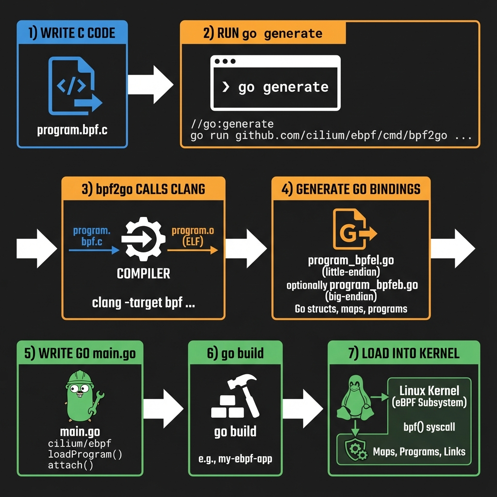
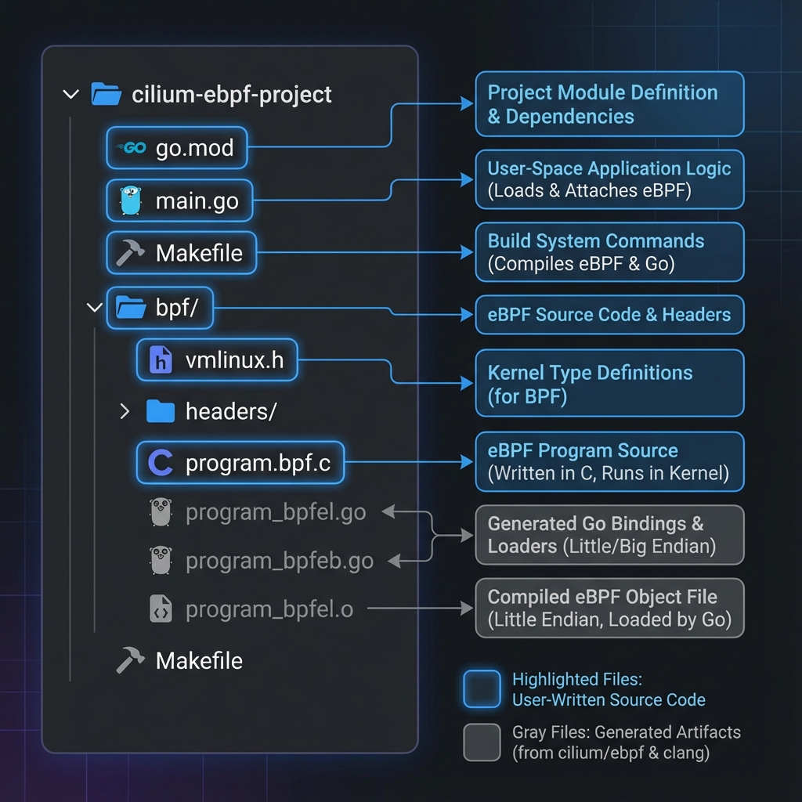
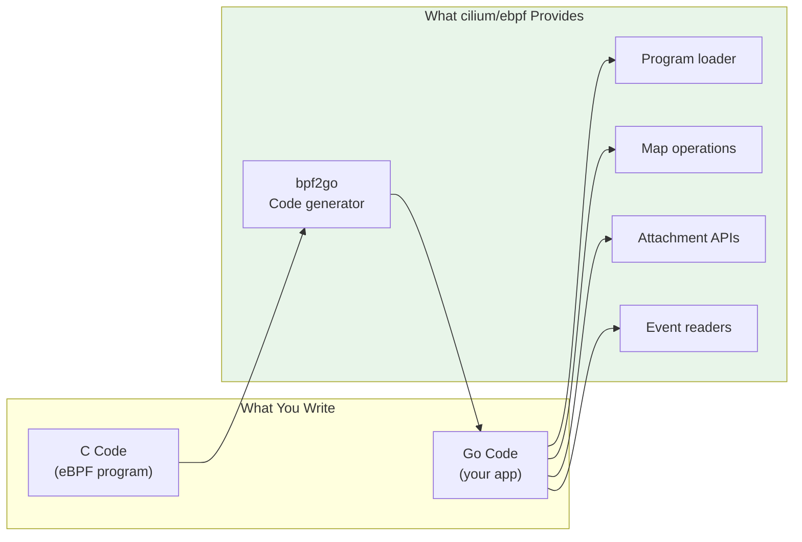
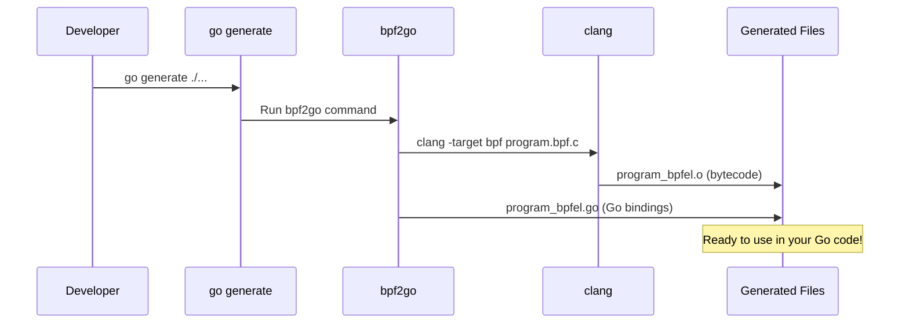

# Module 14: Go Development with cilium/ebpf

> **The practical guide to building eBPF applications in Go**

## 📊 Visual Learning





---

## What is cilium/ebpf?

[cilium/ebpf](https://ebpf-go.dev/) is a **pure Go library** for loading, managing, and interacting with eBPF programs. It's used by major projects like Cilium, Cloudflare, and Datadog.

### What It Does



---

## Project Setup

### 1. Create Project

```bash
mkdir my-ebpf-tool && cd my-ebpf-tool
go mod init github.com/yourusername/my-ebpf-tool

# Install cilium/ebpf
go get github.com/cilium/ebpf
```

### 2. Install Dependencies

```bash
# Ubuntu/Debian
sudo apt-get install -y clang llvm libbpf-dev

# macOS (for cross-compilation)
brew install llvm
export PATH="/opt/homebrew/opt/llvm/bin:$PATH"

# Verify clang can target BPF
clang --target=bpf --print-supported-cpus
```

### 3. Generate vmlinux.h

```bash
# On a Linux machine with BTF support
bpftool btf dump file /sys/kernel/btf/vmlinux format c > bpf/vmlinux.h

# Or download pre-generated
curl -LO https://github.com/libbpf/libbpf-bootstrap/raw/master/vmlinux/vmlinux.h
```

### 4. Recommended Project Structure

```
my-ebpf-tool/
├── go.mod
├── go.sum
├── main.go                    # Your Go application
├── Makefile                   # Build automation
│
├── bpf/
│   ├── vmlinux.h              # Kernel types (generated)
│   ├── bpf_helpers.h          # BPF helper definitions
│   └── program.bpf.c          # Your eBPF C code
│
├── program_bpfel.go           # Generated (little endian)
├── program_bpfeb.go           # Generated (big endian)
└── program_bpfel.o            # Compiled eBPF object
```

**Files you write:** `main.go`, `bpf/program.bpf.c`  
**Files that are generated:** `program_bpfel.go`, `program_bpfeb.go`, `*.o`

---

## The bpf2go Workflow

### How It Works



### Step-by-Step

#### 1. Add the Generate Directive

```go
// main.go
package main

//go:generate go run github.com/cilium/ebpf/cmd/bpf2go -target bpfel -cc clang program ./bpf/program.bpf.c -- -I./bpf

func main() {
    // Your code here
}
```

#### 2. Write Your eBPF Program

```c
// bpf/program.bpf.c
//go:build ignore

#include "vmlinux.h"
#include <bpf/bpf_helpers.h>

struct {
    __uint(type, BPF_MAP_TYPE_HASH);
    __uint(max_entries, 1024);
    __type(key, __u32);
    __type(value, __u64);
} my_map SEC(".maps");

SEC("xdp")
int my_program(struct xdp_md *ctx) {
    __u32 key = 1;
    __u64 value = 42;
    bpf_map_update_elem(&my_map, &key, &value, BPF_ANY);
    return XDP_PASS;
}

char LICENSE[] SEC("license") = "GPL";
```

> **Note:** The `//go:build ignore` prevents Go from trying to compile this C file.

#### 3. Run Generate

```bash
go generate ./...
```

This creates:
- `program_bpfel.go` - Go types and loader for little-endian
- `program_bpfeb.go` - Go types and loader for big-endian
- `program_bpfel.o` - Compiled eBPF bytecode

#### 4. Use Generated Code

```go
// main.go
package main

import (
    "log"
    "github.com/cilium/ebpf/link"
    "net"
)

//go:generate go run github.com/cilium/ebpf/cmd/bpf2go -target bpfel -cc clang program ./bpf/program.bpf.c -- -I./bpf

func main() {
    // Load all eBPF objects
    objs := programObjects{}
    if err := loadProgramObjects(&objs, nil); err != nil {
        log.Fatalf("loading objects: %v", err)
    }
    defer objs.Close()

    // Attach XDP program
    iface, _ := net.InterfaceByName("eth0")
    xdpLink, err := link.AttachXDP(link.XDPOptions{
        Program:   objs.MyProgram,
        Interface: iface.Index,
    })
    if err != nil {
        log.Fatalf("attaching XDP: %v", err)
    }
    defer xdpLink.Close()

    log.Println("Running... Press Ctrl+C to exit")
    select {} // Block forever
}
```

### bpf2go Flags

| Flag | Description | Example |
|------|-------------|---------|
| `-target` | Target architecture | `bpfel`, `bpfeb`, `amd64`, `arm64` |
| `-cc` | C compiler | `clang` |
| `-cflags` | Compiler flags | `"-O2 -g -Wall"` |
| `-type` | Extra Go types to generate | `-type event` |
| `-no-strip` | Keep debug info in object | Useful for debugging |

### Common bpf2go Invocations

```go
// Basic
//go:generate go run github.com/cilium/ebpf/cmd/bpf2go program ./bpf/program.bpf.c

// With include paths
//go:generate go run github.com/cilium/ebpf/cmd/bpf2go program ./bpf/program.bpf.c -- -I./bpf -I./bpf/headers

// With optimization and BTF
//go:generate go run github.com/cilium/ebpf/cmd/bpf2go -cc clang -cflags "-O2 -g" program ./bpf/program.bpf.c -- -I./bpf

// Generate types for ring buffer events
//go:generate go run github.com/cilium/ebpf/cmd/bpf2go -type event program ./bpf/program.bpf.c
```

---

## Generated Code Explained

When you run `go generate`, bpf2go creates:

### programObjects Struct

```go
// program_bpfel.go (generated)
type programObjects struct {
    programPrograms
    programMaps
}

type programPrograms struct {
    MyProgram *ebpf.Program `ebpf:"my_program"`
}

type programMaps struct {
    MyMap *ebpf.Map `ebpf:"my_map"`
}
```

### Loader Function

```go
// program_bpfel.go (generated)
func loadProgramObjects(obj *programObjects, opts *ebpf.CollectionOptions) error {
    // Loads bytecode, creates programs and maps
}
```

### Usage Pattern

```go
func main() {
    objs := programObjects{}
    
    // Load everything
    err := loadProgramObjects(&objs, nil)
    
    // Access programs
    objs.MyProgram  // *ebpf.Program
    
    // Access maps
    objs.MyMap      // *ebpf.Map
    
    // Always close when done
    defer objs.Close()
}
```

---

## Map Operations

### Basic Operations

```go
// Lookup
var value uint64
err := objs.MyMap.Lookup(uint32(key), &value)
if errors.Is(err, ebpf.ErrKeyNotExist) {
    // Key doesn't exist
}

// Put (insert or update)
err = objs.MyMap.Put(uint32(key), uint64(value))

// Update (must exist)
err = objs.MyMap.Update(uint32(key), uint64(value), ebpf.UpdateExist)

// Delete
err = objs.MyMap.Delete(uint32(key))
```

### Iteration

```go
var key uint32
var value uint64

iter := objs.MyMap.Iterate()
for iter.Next(&key, &value) {
    fmt.Printf("Key: %d, Value: %d\n", key, value)
}
if err := iter.Err(); err != nil {
    log.Printf("iteration error: %v", err)
}
```

### Batch Operations

```go
// Batch lookup (efficient for many keys)
keys := []uint32{1, 2, 3, 4, 5}
values := make([]uint64, len(keys))

count, err := objs.MyMap.BatchLookup(keys, values, nil)
```

### Per-CPU Maps

```go
// Per-CPU maps return a slice (one value per CPU)
var values []uint64  // Will have len(values) == numCPUs

err := objs.PerCPUCounter.Lookup(uint32(0), &values)

// Aggregate
var total uint64
for _, v := range values {
    total += v
}
```

---

## Attaching Programs

### XDP

```go
import "github.com/cilium/ebpf/link"

iface, _ := net.InterfaceByName("eth0")

l, err := link.AttachXDP(link.XDPOptions{
    Program:   objs.XdpProg,
    Interface: iface.Index,
    Flags:     link.XDPGenericMode,  // or XDPDriverMode
})
defer l.Close()
```

### TC (Traffic Control)

```go
import "github.com/cilium/ebpf/link"

l, err := link.AttachTCX(link.TCXOptions{
    Interface: iface.Index,
    Program:   objs.TcProg,
    Attach:    ebpf.AttachTCXIngress,  // or AttachTCXEgress
})
defer l.Close()
```

### Kprobe

```go
l, err := link.Kprobe("tcp_connect", objs.KprobeTcpConnect, nil)
defer l.Close()
```

### Tracepoint

```go
l, err := link.Tracepoint("syscalls", "sys_enter_execve", objs.TraceExecve, nil)
defer l.Close()
```

### Cgroup

```go
cgroupPath := "/sys/fs/cgroup/unified"

l, err := link.AttachCgroup(link.CgroupOptions{
    Path:    cgroupPath,
    Attach:  ebpf.AttachCGroupInetIngress,
    Program: objs.CgroupProg,
})
defer l.Close()
```

---

## Reading Events

### Ring Buffer

```go
import "github.com/cilium/ebpf/ringbuf"

rd, err := ringbuf.NewReader(objs.Events)
if err != nil {
    log.Fatal(err)
}
defer rd.Close()

for {
    record, err := rd.Read()
    if errors.Is(err, ringbuf.ErrClosed) {
        return
    }
    if err != nil {
        log.Printf("reading: %v", err)
        continue
    }
    
    // Parse record.RawSample
    processEvent(record.RawSample)
}
```

### Perf Event Array

```go
import "github.com/cilium/ebpf/perf"

rd, err := perf.NewReader(objs.Events, 4096)
if err != nil {
    log.Fatal(err)
}
defer rd.Close()

for {
    record, err := rd.Read()
    if err != nil {
        continue
    }
    
    if record.LostSamples > 0 {
        log.Printf("lost %d samples", record.LostSamples)
        continue
    }
    
    processEvent(record.RawSample)
}
```

---

## Debugging Techniques

### 1. Verifier Errors

```go
// Get detailed verifier output on error
err := loadProgramObjects(&objs, &ebpf.CollectionOptions{
    Programs: ebpf.ProgramOptions{
        LogLevel: ebpf.LogLevelInstruction,
        LogSize:  1024 * 1024,  // 1MB log buffer
    },
})

var ve *ebpf.VerifierError
if errors.As(err, &ve) {
    fmt.Printf("Verifier error:\n%+v\n", ve)
}
```

### 2. bpf_printk Tracing

In your C code:
```c
bpf_printk("Debug: key=%d value=%d\n", key, value);
```

Read the output:
```bash
sudo cat /sys/kernel/debug/tracing/trace_pipe
```

### 3. bpftool Inspection

```bash
# List loaded programs
sudo bpftool prog list

# Show program details
sudo bpftool prog show id 123

# Dump map contents
sudo bpftool map dump id 45

# Show attached programs
sudo bpftool net list
```

### 4. Program Statistics

```bash
# Enable stats
sudo sysctl -w kernel.bpf_stats_enabled=1

# View run count and time
sudo bpftool prog show
# ID 123 ... run_time_ns 12345 run_cnt 1000
```

---

## Testing

### Unit Testing Maps

```go
func TestMapOperations(t *testing.T) {
    objs := programObjects{}
    if err := loadProgramObjects(&objs, nil); err != nil {
        t.Skipf("loading objects: %v", err)
    }
    defer objs.Close()

    // Test put and lookup
    key := uint32(42)
    value := uint64(100)

    if err := objs.MyMap.Put(key, value); err != nil {
        t.Fatalf("put: %v", err)
    }

    var got uint64
    if err := objs.MyMap.Lookup(key, &got); err != nil {
        t.Fatalf("lookup: %v", err)
    }

    if got != value {
        t.Errorf("got %d, want %d", got, value)
    }
}
```

### Testing with BPF_PROG_RUN

```go
import "github.com/cilium/ebpf"

func TestXDPProgram(t *testing.T) {
    objs := programObjects{}
    if err := loadProgramObjects(&objs, nil); err != nil {
        t.Skip(err)
    }
    defer objs.Close()

    // Create test packet
    packet := []byte{
        // Ethernet header (14 bytes)
        0xff, 0xff, 0xff, 0xff, 0xff, 0xff,  // dst MAC
        0x00, 0x11, 0x22, 0x33, 0x44, 0x55,  // src MAC
        0x08, 0x00,                           // EtherType (IPv4)
        // Add IP header, etc.
    }

    ret, _, err := objs.XdpProg.Test(packet)
    if err != nil {
        t.Fatalf("test run: %v", err)
    }

    if ret != 2 { // XDP_PASS
        t.Errorf("got return code %d, want XDP_PASS (2)", ret)
    }
}
```

---

## Common Patterns

### Graceful Shutdown

```go
func main() {
    objs := programObjects{}
    if err := loadProgramObjects(&objs, nil); err != nil {
        log.Fatal(err)
    }
    defer objs.Close()

    l, err := link.AttachXDP(...)
    if err != nil {
        log.Fatal(err)
    }
    defer l.Close()

    // Signal handling
    ctx, cancel := signal.NotifyContext(context.Background(), 
        syscall.SIGINT, syscall.SIGTERM)
    defer cancel()

    // Your main loop
    go processEvents(ctx, objs)

    <-ctx.Done()
    log.Println("Shutting down...")
}
```

### Prometheus Metrics

```go
import "github.com/prometheus/client_golang/prometheus"

var (
    packetsProcessed = prometheus.NewCounter(prometheus.CounterOpts{
        Name: "ebpf_packets_processed_total",
        Help: "Total packets processed by eBPF",
    })
)

func init() {
    prometheus.MustRegister(packetsProcessed)
}

func updateMetrics(objs *programObjects) {
    var count uint64
    if err := objs.PacketCount.Lookup(uint32(0), &count); err == nil {
        packetsProcessed.Add(float64(count))
    }
}
```

### Configuration via Maps

```go
// Set config before attaching
type Config struct {
    Enabled uint32
    RateLimit uint32
}

config := Config{Enabled: 1, RateLimit: 1000}
if err := objs.ConfigMap.Put(uint32(0), config); err != nil {
    log.Fatal(err)
}

// Now attach the program
link.AttachXDP(...)
```

---

## IDE Setup

### VS Code

Install extensions:
- **Go** (golang.go)
- **C/C++** (ms-vscode.cpptools)

Create `.vscode/c_cpp_properties.json`:
```json
{
    "configurations": [
        {
            "name": "eBPF",
            "includePath": [
                "${workspaceFolder}/bpf/**",
                "/usr/include"
            ],
            "defines": ["__TARGET_ARCH_x86"],
            "compilerPath": "/usr/bin/clang",
            "cStandard": "c11",
            "intelliSenseMode": "linux-clang-x64"
        }
    ],
    "version": 4
}
```

### GoLand / IntelliJ

1. Install **C/C++ Plugin**
2. Mark `bpf/` as a source root
3. Add include paths in C/C++ settings

---

## Makefile Template

```makefile
.PHONY: all generate build clean test

CLANG ?= clang
CFLAGS := -O2 -g -Wall -target bpf

all: generate build

generate:
	go generate ./...

build:
	CGO_ENABLED=0 go build -o my-tool .

clean:
	rm -f my-tool
	rm -f *_bpfel.go *_bpfeb.go *_bpfel.o *_bpfeb.o

test:
	go test -v ./...

# For development - regenerate on C file changes  
watch:
	while true; do \
		inotifywait -e modify bpf/*.c && make generate; \
	done
```

---

## Troubleshooting

### Common Errors

| Error | Cause | Fix |
|-------|-------|-----|
| `clang: command not found` | Clang not installed | `apt install clang llvm` |
| `vmlinux.h: No such file` | Missing header | Generate or download vmlinux.h |
| `program too large` | Instruction limit | Simplify program, use tail calls |
| `invalid memory access` | Bounds check | Add pointer validation |
| `permission denied` | Not root | Run with `sudo` or add capabilities |

### Required Capabilities

```bash
# Instead of running as root
sudo setcap cap_bpf,cap_net_admin,cap_perfmon=eip ./my-tool
```

---

## Key Takeaways

| Topic | Remember |
|-------|----------|
| **bpf2go** | Generates Go bindings from C code |
| **go generate** | Runs bpf2go, creates `*_bpfel.go` |
| **programObjects** | Contains all programs and maps |
| **Always defer Close()** | Prevents resource leaks |
| **Verifier errors** | Use LogLevel for details |
| **Testing** | BPF_PROG_RUN for XDP/TC testing |

---

## Next Steps

You now have everything needed to build production eBPF applications in Go!

Recommended practice:
1. Build the packet sniffer from Module 13
2. Add Prometheus metrics
3. Write unit tests with BPF_PROG_RUN
4. Deploy with proper capabilities

---

## Further Reading

- [ebpf-go.dev](https://ebpf-go.dev/) - Official documentation
- [cilium/ebpf Examples](https://github.com/cilium/ebpf/tree/main/examples)
- [bpf2go Documentation](https://pkg.go.dev/github.com/cilium/ebpf/cmd/bpf2go)
- [Isovalent eBPF Training](https://isovalent.com/labs/)
